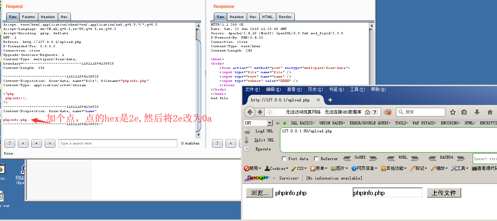
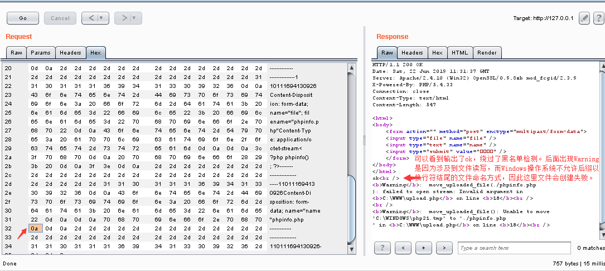
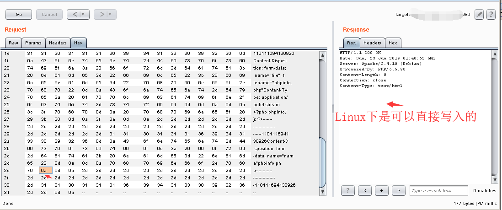
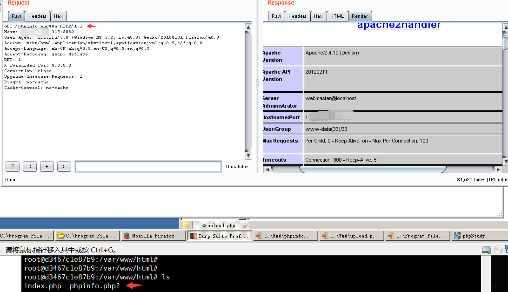
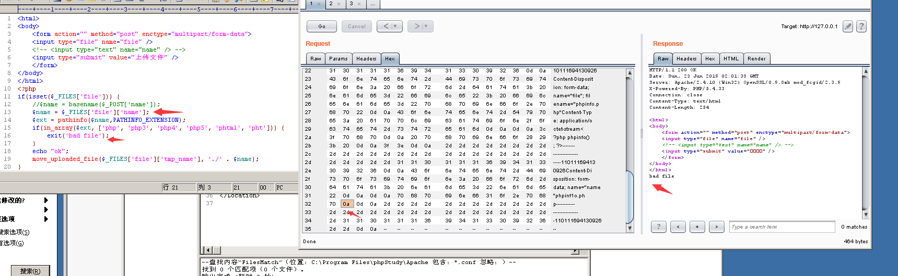

### Apache HTTPD 换行解析漏洞（CVE-2017-15715）
影响范围：2.4.0~2.4.29版本
环境：phpstudy2014 Apache + PHP5.4n

此漏洞形成的根本原因，在于`$`, 正则表达式中`$`不仅匹配字符串结尾位置，也可以匹配`\n` 或 `\r`

在解析PHP时，1.php\x0A将被按照PHP后缀进行解析，导致绕过一些服务器的安全策略。
```
<FilesMatch \.php$>
    SetHandler application/x-httpd-php
</FilesMatch>
```

测试代码：
```
<html>
<body>
    <form action="" method="post" enctype="multipart/form-data">
    <input type="file" name="file" />
    <input type="text" name="name" />
    <input type="submit" value="上传文件" />
    </form>
</body>
</html>
<?php
if(isset($_FILES['file'])) {
    $name = basename($_POST['name']);
    $ext = pathinfo($name,PATHINFO_EXTENSION);
    if(in_array($ext, ['php', 'php3', 'php4', 'php5', 'phtml', 'pht'])) {
        exit('bad file');
    }
echo "ok";
    move_uploaded_file($_FILES['file']['tmp_name'], './' . $name);
}
?>
```


点击Go后，效果如下:



相同代码在Linux下进行测试，可以正常写入。


访问：


限制：获取文件名时不能用$_FILES['file']['name']，因为它会自动把换行去掉。


### 修复建议
1. 升级到最新版本
2. 或将上传的文件重命名为为时间戳+随机数+.jpg的格式并禁用上传文件目录执行脚本权限。