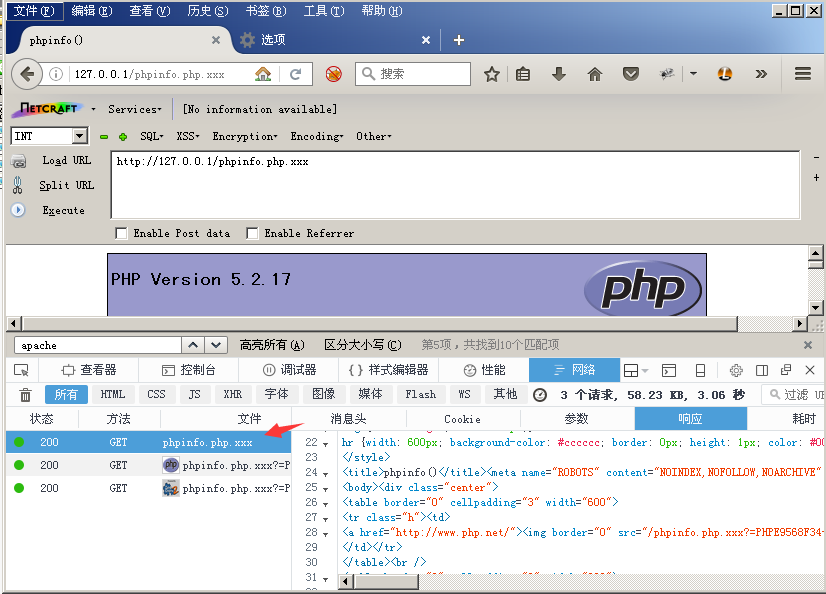
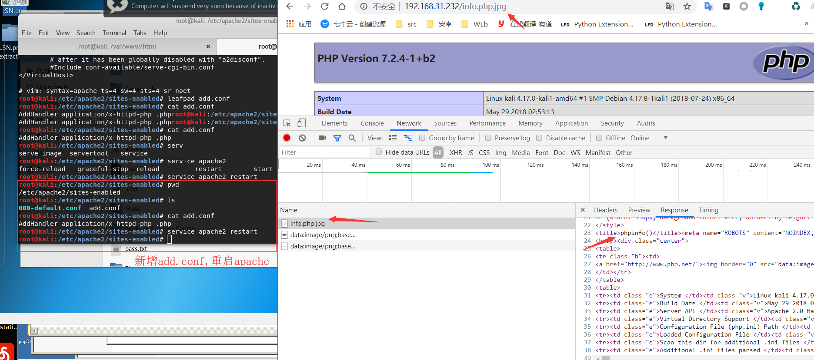

## 解析漏洞
### 未知扩展名解析漏洞

Apache的解析漏洞依赖于一个特性： **Apache默认一个文件可以有多个以点分割的后缀，当最右边的后缀无法识别（不在mime.types文件内），则继续向左识别，直到识别到合法后缀才进行解析。**

复现：
这里使用phpstudy进行复现。
下载地址：
http://phpstudy.php.cn/phpstudy/phpStudy(PHP5.2).zip

访问phpinfo.php.xxx

实战中可以上传rar，owf等文件进行利用，如果上传phpinfo.php.jpg，即使文件名中有.php，也会直接解析为jpg。因为Apache认识.jpg,停止继续向左识别。

### AddHandler导致的解析漏洞。

如果运维人员给.php后缀增加了处理器：
`AddHandler application/x-httpd-php .php`
那么，在有多个后缀的情况下，只要一个文件名中含有.php后缀，即被识别成PHP文件，没必要是最后一个后缀。
利用这个特性，将会造成一个可以绕过上传白名单的解析漏洞。

复现：

即使最右边的文件格式是在mime.types文件内，只要文件名中出现.php，就直接被解析为php。

