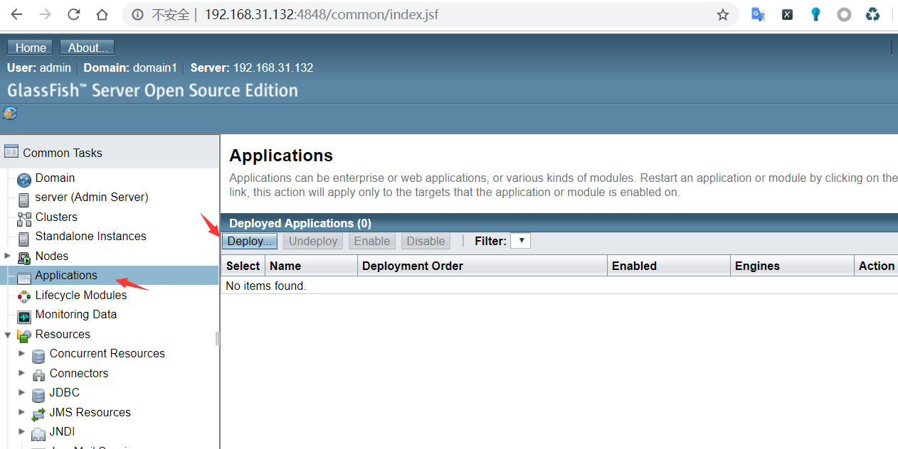
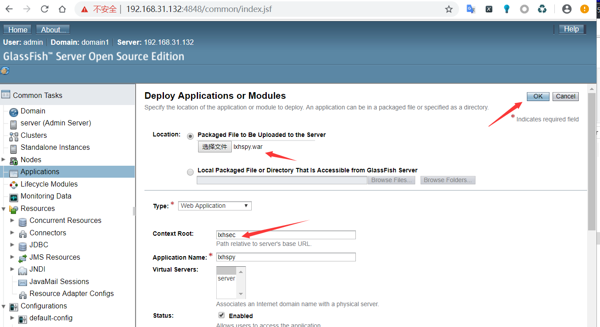

## GlassFish 后台Getshell
进入后台后 Applications，右边的deploy

选中war包后上传，填写Context Root 这个关系到你访问的url，点击Ok。

访问`http://127.0.0.1:8080/[Context Root]/[war包内的filename]`

Note: **如果管理员不设置帐号本地会自动登录，但是远程访问会提示配置错误。Configuration Error Secure Admin must be enabled to access the DAS remotely**

### 修复建议
1.不开放后台给外网，
2.若开放 密码强度需设置 包含 大写字母，小写字母，数字，特殊字符，且长度大于10位。