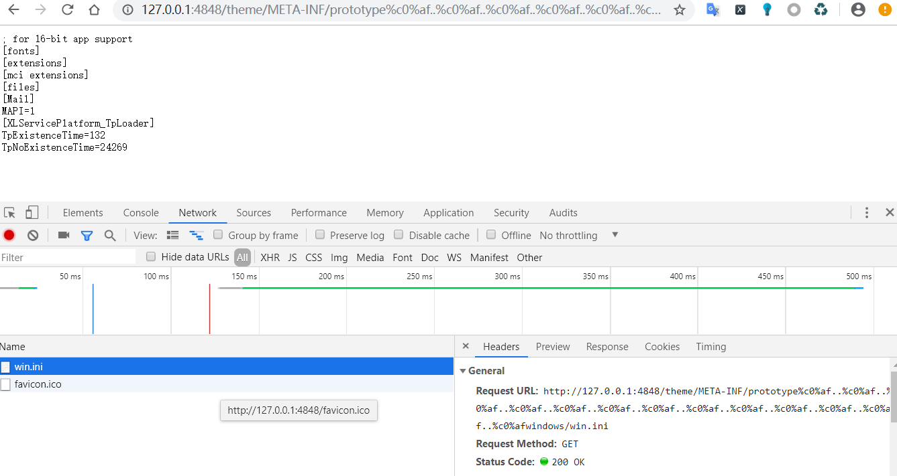
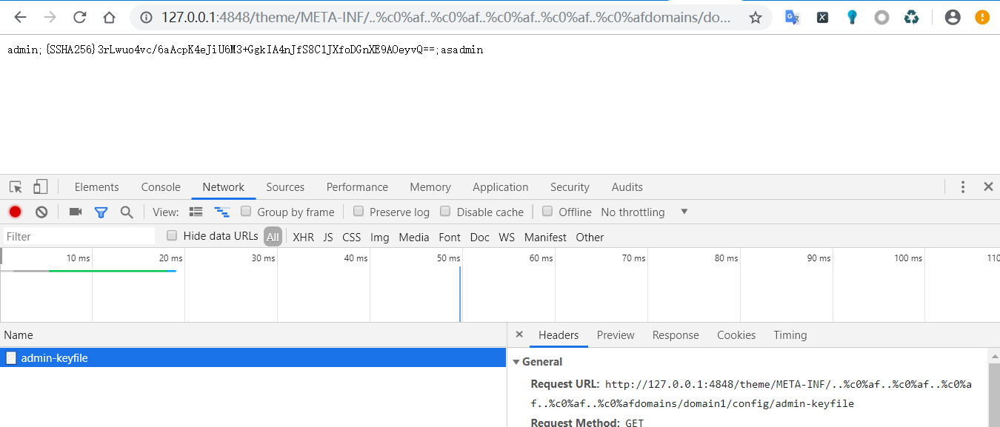

## GlassFish Directory Traversal（CVE-2017-1000028）

java语言中会把%c0%af解析为\uC0AF，最后转义为ASCCII字符的`/`（斜杠）。利用..%c0%af..%c0%af来向上跳转，达到目录穿越、任意文件读取的效果。

计算机指定了UTF8编码接收二进制并进行转义，当发现字节以0开头，表示这是一个标准ASCII字符，直接转义，当发现110开头，则取2个字节 去掉110模板后转义。
UTF8编码模板如下

|字节数|大小范围（十进制）|字节1|字节2|字节3|字节4|
|-|-|-|-|-|-|
|1|U + 0000~ U + 007F（0~127）|0xxxxxxx|None|None|None|
|2|U + 0080~ U + 07FF（128~2047）|110xxxxx|10xxxxxx|None|None|
|3|U + 0800~ U + 0FFF（2048~65535）|1110xxxx|10xxxxxx|10xxxxxx|None|
|4|U + 10000 ~ U + 10FFFF(65536~‭1114111)|11110xxx|10xxxxxx|10xxxxxx|10xxxxxx|

C0AF 转换位二进制为 ‭‭110 00000 10 101111‬  ，110开头去掉摸板后为00000 101111 转换为10进制为47，ASSCI为`/`.

受影响版本：<=4.1.2版本

启动GlassFish后 ，访问
`http://your-ip:4848/theme/META-INF/prototype%c0%af..%c0%af..%c0%af..%c0%af..%c0%af..%c0%af..%c0%af..%c0%af..%c0%af..%c0%af..%c0%af..%c0%af..%c0%afwindows/win.ini`, 发现成功读取win.ini文件。

Note:**如果在你的机器上不能成功读取，请自行添加..%c0%af**

读admin-keyfile文件，该文件是储存admin账号密码的文件,爆破。
位置在`glassfish/domains/domain1/config/admin-keyfile`

### 修复建议
升级GlassFish最新版本。