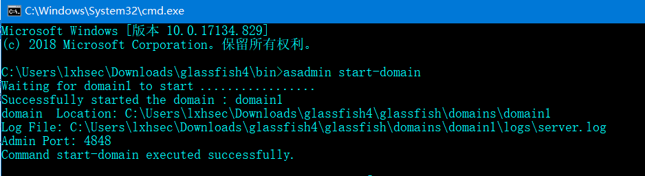

# GlassFish

GlassFish 是用于构建 Java EE 5应用服务器的开源开发项目的名称。它基于 Sun Microsystems 提供的 Sun Java System Application Server PE 9 的源代码以及 Oracle 贡献的 TopLink 持久性代码。该项目提供了开发高质量应用服务器的结构化过程，以前所未有的速度提供新的功能。

默认端口：8080（Web应用端口，即网站内容），4848（GlassFish管理中心）

默认返回的指纹信息:
```
Server: GlassFish Server Open Source Edition  4.1.2

X-Powered-By: Servlet/3.1 JSP/2.3 (GlassFish Server Open Source Edition  4.1.2  Java/Oracle Corporation/1.8)
```

[下载4.1.2版本](https://download.java.net/glassfish/4.1.2/release/glassfish-4.1.2.zip)

解压后，进入glassfish/bin目录下打开CMD窗口输入`asadmin start-domain`启动glassfish


asadmin stop-domain 停止glassfish