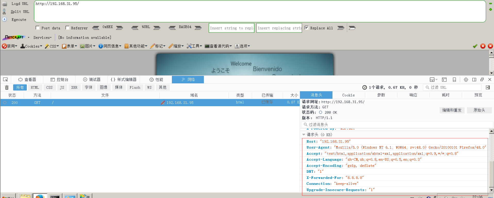
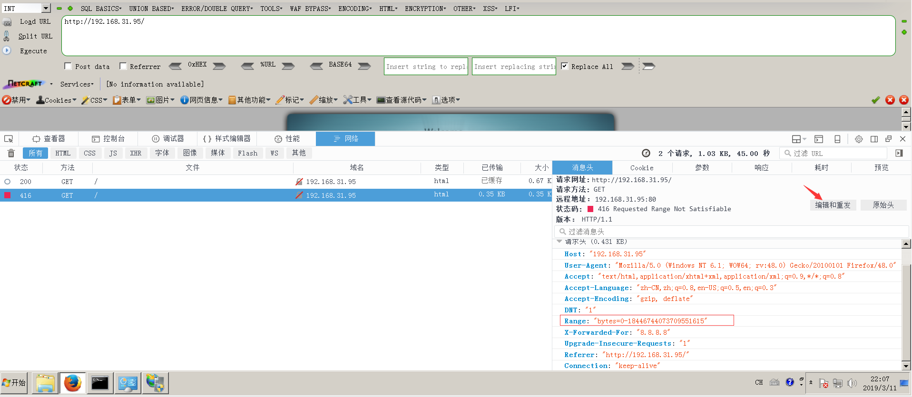

## HTTP.SYS远程代码执行 (MS15-034)

影响范围：
Windows 7、Windows Server 2008 R2、Windows 8、Windows Server 2012、Windows 8.1 和 Windows Server 2012 R2

复现：

在Windows7上 安装IIS7.5。
1.访问。

2.编辑请求头，增加`Range: bytes=0-18446744073709551615`字段，若返回码状态为`416 Requested Range Not Satisfiable`，则存在HTTP.SYS远程代码执行漏洞

漏洞有点鸡肋，配合其他漏洞使用还是可以用用的，具体使用可转至MSF中。

### 修复建议
安装修复补丁（KB3042553）