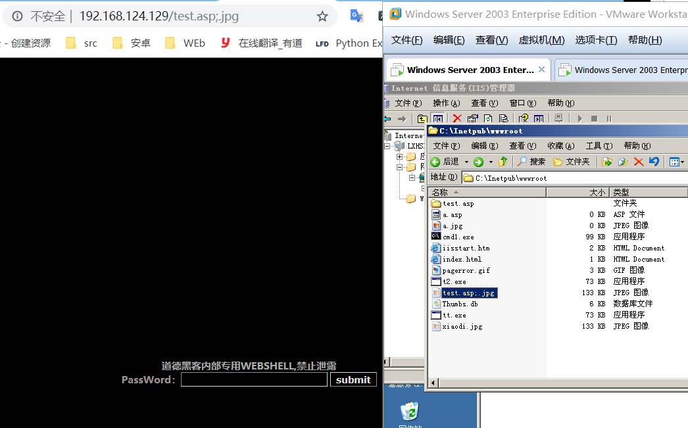
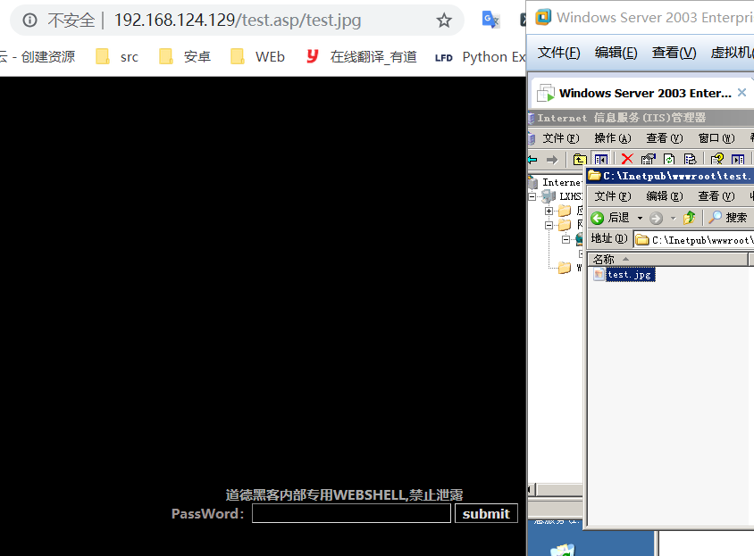
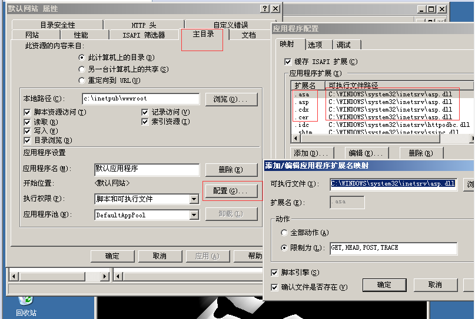
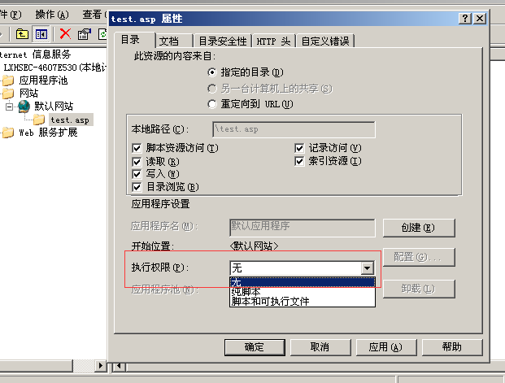
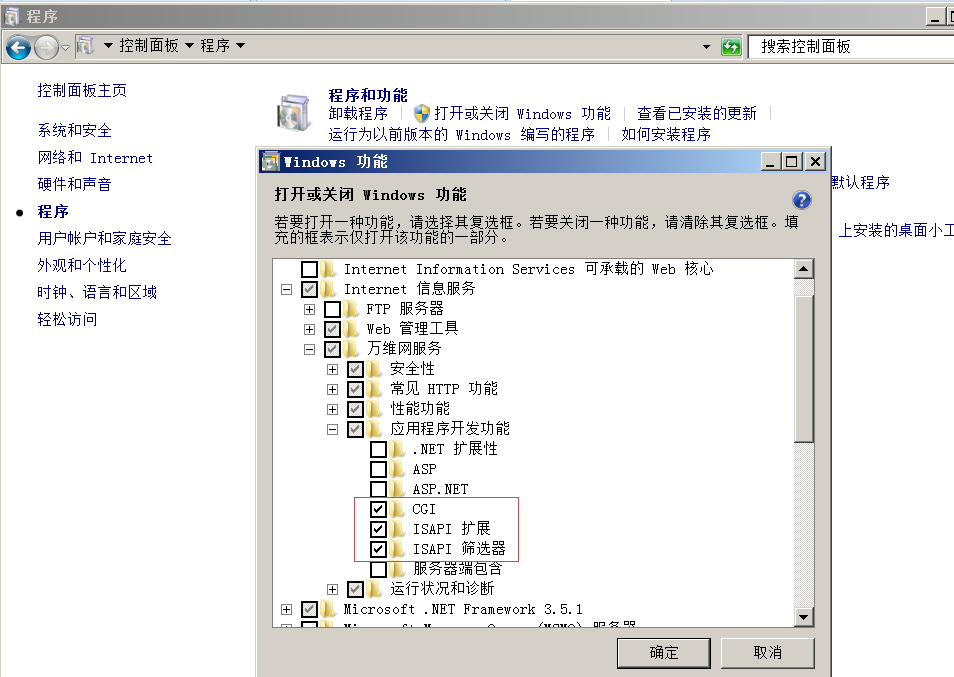
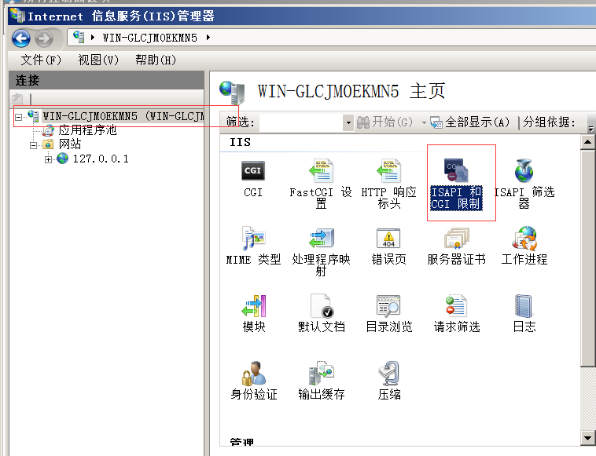
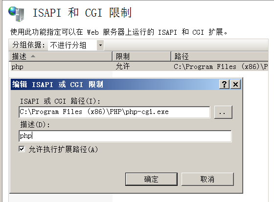
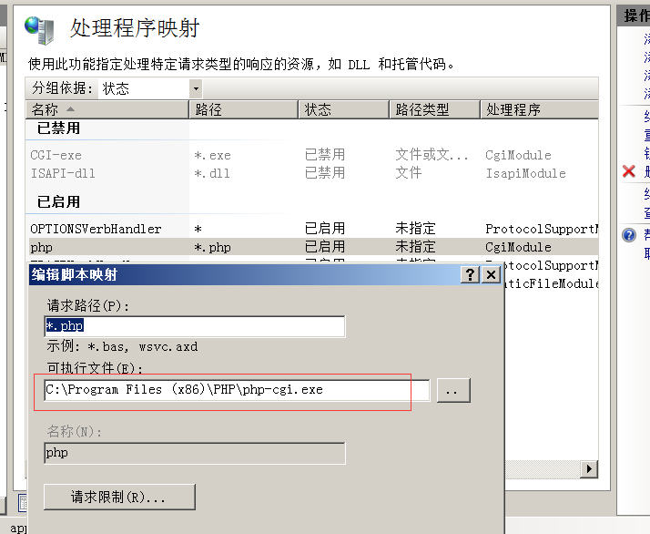
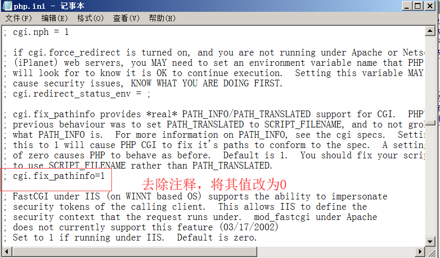
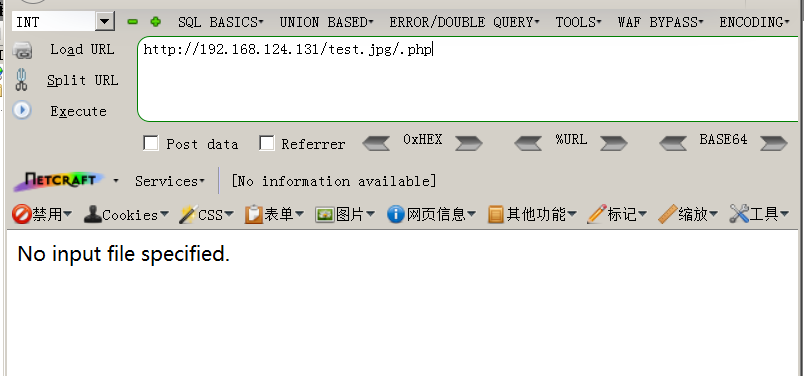

## 解析漏洞

### IIS 6.x

基于文件名

该版本 默认会将 *.asp;.jpg 此种格式的文件名，当成Asp解析，原理是 服务器默认不解析; 号及其后面的内容，相当于截断。

基于文件夹名

该版本 默认会将 *.asp/目录下的所有文件当成Asp解析。

另外，IIS6.x除了会将扩展名为.asp的文件解析为asp之外，还默认会将扩展名为.asa，.cdx，.cer解析为asp，
从网站属性->主目录->配置 可以看出，他们都是调用了asp.dll进行的解析。

#### 修复建议
由于微软并不认为这是一个漏洞，也没有推出IIS 6.0的补丁，因此漏洞需要自己修复。
1. 限制上传目录执行权限，不允许执行脚本。

2. 不允许新建目录。
3. 上传的文件需经过重命名(时间戳+随机数+.jpg等)

### IIS 7.x

安装IIS7.5，
1.控制面板 -> 程序 -> 打开或关闭windows功能。

2.下载[php](http://windows.php.net/downloads/releases/archives/)-5.2.6-win32-installer.msi

3.打开msi，一直下一步来到选择`web server setup`的界面，在这里选择`IIS fastcgi`,之后一直下一步。

4.打开IIS，管理工具 ->Internet 信息服务(IIS)管理器

5.选择编辑ISAPI或者CGI限制

添加安装的php-cgi.exe路径，描述随意。

6.返回第五步的第一个图片位置，点击处理程序映射，添加如下。

7.phpinfo测试

IIS7.x版本 在`Fast-CGI`运行模式下,在任意文件，例：test.jpg后面加上/.php，会将test.jpg 解析为php文件。

#### 修复建议
配置cgi.fix_pathinfo(php.ini中)为0并重启php-cgi程序

结果如下：
