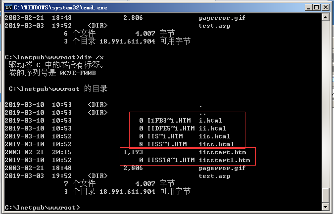
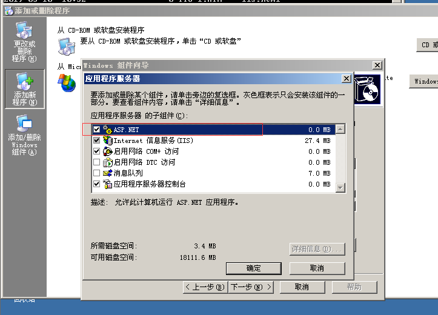
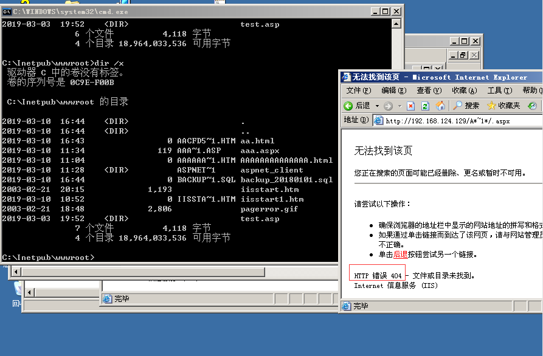
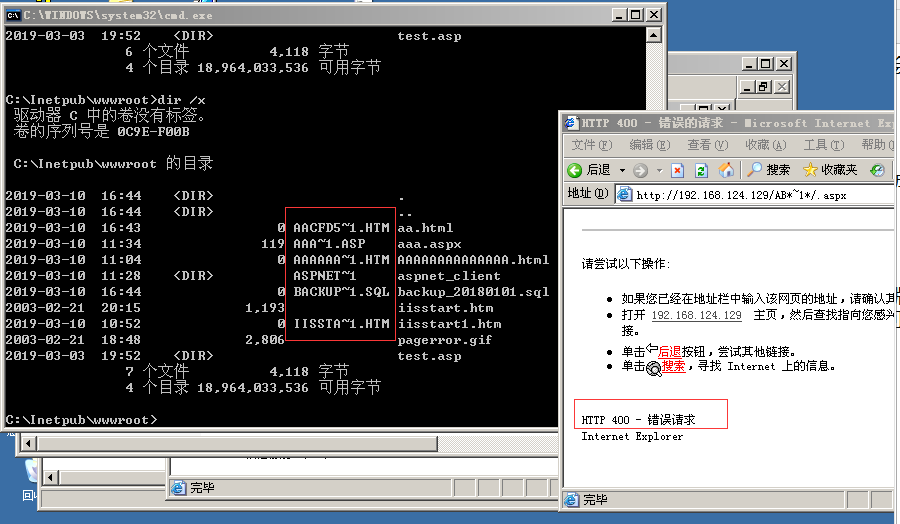
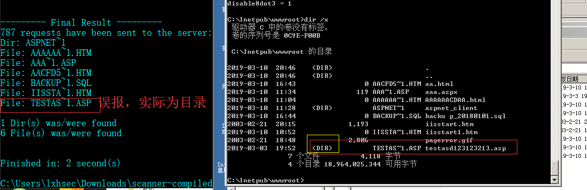
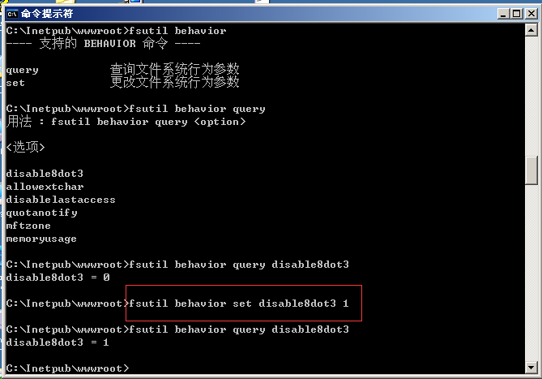
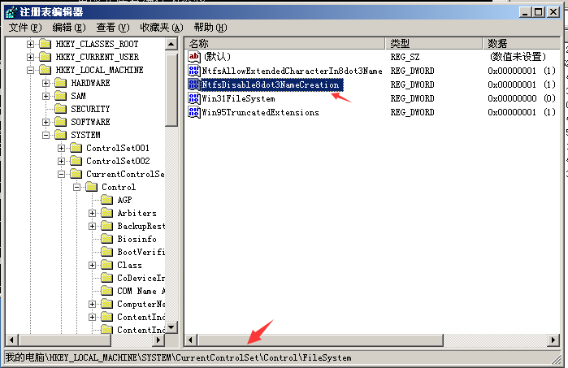

## IIS短文件漏洞

Windows 以 8.3 格式生成与 MS-DOS 兼容的（短）文件名，以允许基于 MS-DOS 或 16 位 Windows的程序访问这些文件。在cmd下输入"dir /x"即可看到短文件名的效果。

IIS短文件名产生：
> 
1.当后缀小于4时，短文件名产生需要文件(夹)名前缀字符长度大于等于9位。
2.当后缀大于等于4时，文件名前缀字符长度即使为1，也会产生短文件名。

目前IIS支持短文件名猜测的HTTP方法主要包括：DEBUG、OPTIONS、GET、POST、HEAD、TRACE六种。
IIS 8.0之后的版本只能通过OPTIONS和TRACE方法被猜测成功。

复现：

IIS8.0以下版本需要开启ASP.NET支持，IIS大于等于8.0版本,即使没有安装ASP.NET，通过OPTIONS和TRACE方法也可以猜解成功。
以下通过开启IIS6.0 ASP.NET后进行复现。

当访问构造的某个存在的短文件名，会返回404；

当访问构造的某个不存在的短文件名，会返回400；

IIS短文件漏洞局限性
1) 如果文件名本身太短也是无法猜解的；
2) 此漏洞只能确定前6个字符，如果后面的字符太长、包含特殊字符，很难猜解；
3) 如果文件名前6位带空格，8.3格式的短文件名会补进，和真实文件名不匹配；
4) 如果文件夹名前6位字符带点"."，扫描程序会认为是文件而不是文件夹，最终出现误报；
5) 不支持中文文件名，包括中文文件和中文文件夹。一个中文相当于两个英文字符，故超过4个中文字会产生短文件名，但是IIS不支持中文猜测。

[短文件利用工具下载](https://github.com/irsdl/IIS-ShortName-Scanner)

### 修复建议
1）从CMD命令关闭NTFS 8.3文件格式的支持

Windows Server 2003： (1代表关闭，0代表开启）
关闭该功能：`fsutil behavior set disable8dot3 1`

Windows Server 2008 R2：
> 
查询是否开启短文件名功能：fsutil 8dot3name query
关闭该功能：fsutil 8dot3name set 1

不同系统关闭命令稍有区别，该功能默认是开启的.

2）或从修改注册表关闭NTFS 8.3文件格式的支持

快捷键Win+R打开命令窗口，输入regedit打开注册表窗口

找到路径：
`HKEY_LOCAL_MACHINE\SYSTEM\CurrentControlSet\Control\FileSystem`，将其中的 `NtfsDisable8dot3NameCreation`这一项的值设为 1，1代表不创建短文件名格式

以上两种方式修改完成后，均需要重启系统生效。

Note:此方法只能禁止NTFS8.3格式文件名创建,已经存在的文件的短文件名无法移除，需要重新复制才会消失。
例:将web文件夹的内容拷贝到另一个位置，如c:\www到c:\ww,然后删除原文件夹，再重命名c:\ww到c:\www。
