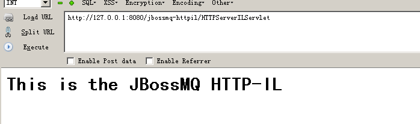
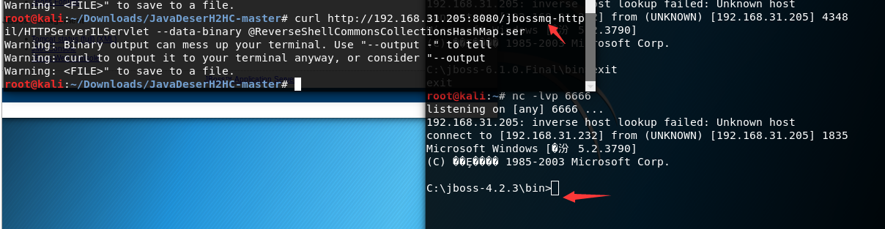

## JBoss <=4.x JBossMQ JMS 反序列化漏洞（CVE-2017-7504）

环境:jboss-4.2.3

设置外网访问:
在`C:\jboss-4.2.3\server\default\deploy\jboss-web.deployer\server.xml`
将address="${jboss.bind.address} 改为：address="0.0.0.0", 重启Jboss
```
<Connector port="8080" address="${jboss.bind.address}"    
     maxThreads="250" maxHttpHeaderSize="8192"
     emptySessionPath="true" protocol="HTTP/1.1"
     enableLookups="false" redirectPort="8443" acceptCount="100"
     connectionTimeout="20000" disableUploadTimeout="true" />
```

访问/jbossmq-httpil/HTTPServerILServlet，
返回`This is the JBossMQ HTTP-IL`，说明页面存在，此页面存在反序列化漏洞。


这里直接利用CVE-2017-12149生成的ser，发送到/jbossmq-httpil/HTTPServerILServlet接口中。
如下：


### 修复建议
升级至最新版。