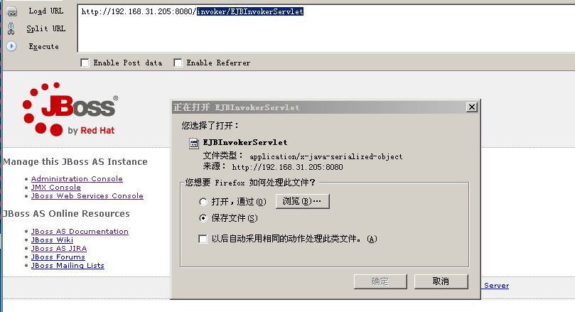
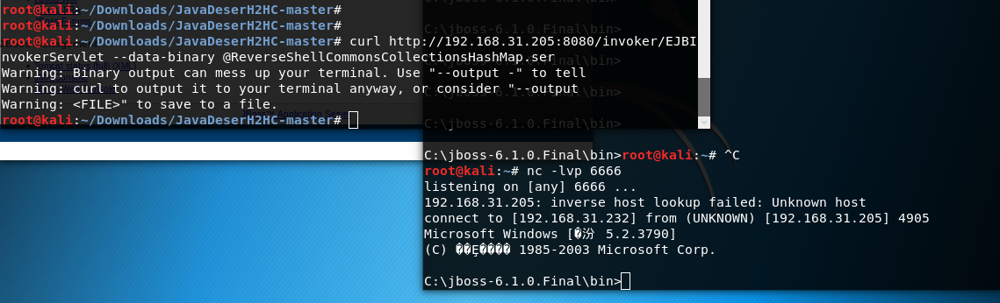
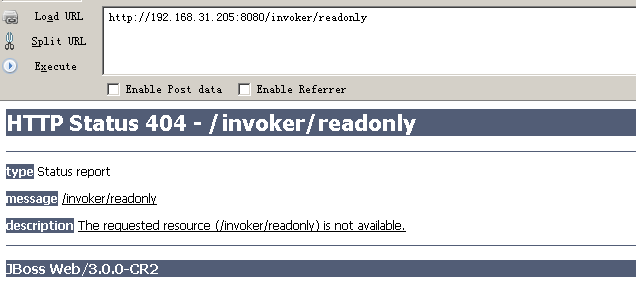

## JBoss EJBInvokerServlet 反序列化漏洞

访问 /invoker/EJBInvokerServlet
返回如下，说明接口开放，此接口存在反序列化漏洞。

这里直接利用CVE-2017-12149生成的ser，发送到/invoker/EJBInvokerServlet接口中。
如下：

## 修复建议
1. 不需要 http-invoker.sar 组件的用户可直接删除此组件。路径为：`C:\jboss-6.1.0.Final\server\default\deploy\http-invoker.sar`,删除后访问404.

2. 或添加如下代码至 http-invoker.sar 下 web.xml 的 security-constraint 标签中，对 http invoker 组件进行访问控制：
`<url-pattern>/*</url-pattern>`
路径为：`C:\jboss-6.1.0.Final\server\default\deploy\http-invoker.sar\invoker.war\WEB-INF\web.xml`
