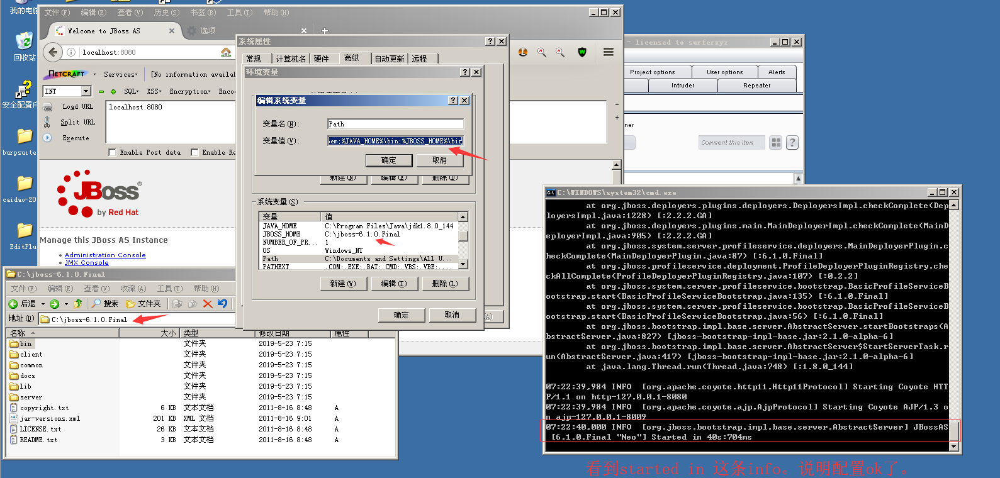
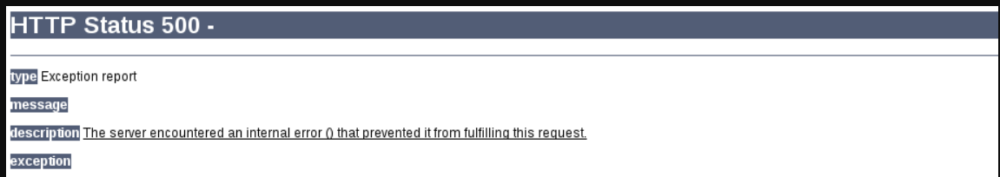

# JBoss
jBoss是一个基于J2EE的开发源代码的应用服务器。 JBoss代码遵循LGPL许可，可以在任何商业应用中免费使用。JBoss是一个管理EJB的容器和服务器，支持EJB1.1、EJB 2.0和EJB3的规范。但JBoss核心服务不包括支持servlet/JSP的WEB容器，一般与Tomcat或Jetty绑定使用。

默认端口:8080,9990


Windows下Jboss安装，
1. 下载http://jbossas.jboss.org/downloads/
2. 解压，我这里解压后的目录为：C:\jboss-6.1.0.Final
3. 新建环境变量：JBOSS_HOME 值为： C:\jboss-6.1.0.Final
在path中加入：;%JBOSS_HOME%\bin; 
4. 打开C:\jboss-6.1.0.Final\bin 双击run.bat。出现info消息，即配置成功。


**Note:注意JDK版本要在1.6~1.7之间，1.8版本 jBoss运行打开JMX Console会出现500错误。**


jboss默认部署路径：C:\jboss-6.1.0.Final\server\default\deploy\ROOT.war

设置外网访问，
将C:\jboss-6.1.0.Final\server\default\deploy\jbossweb.sar\server.xml

```
      <!-- A HTTP/1.1 Connector on port 8080 -->
      <Connector protocol="HTTP/1.1" port="${jboss.web.http.port}" address="${jboss.bind.address}" 
         redirectPort="${jboss.web.https.port}" />
```
将address="${jboss.bind.address}" 设置为address="0.0.0.0" ,并重启JBoss