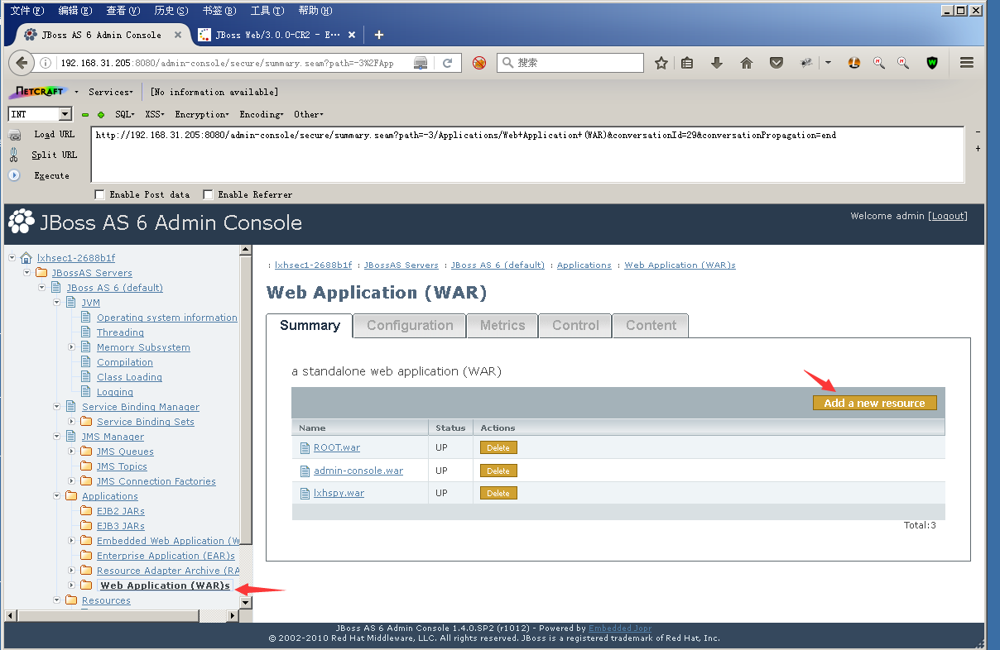
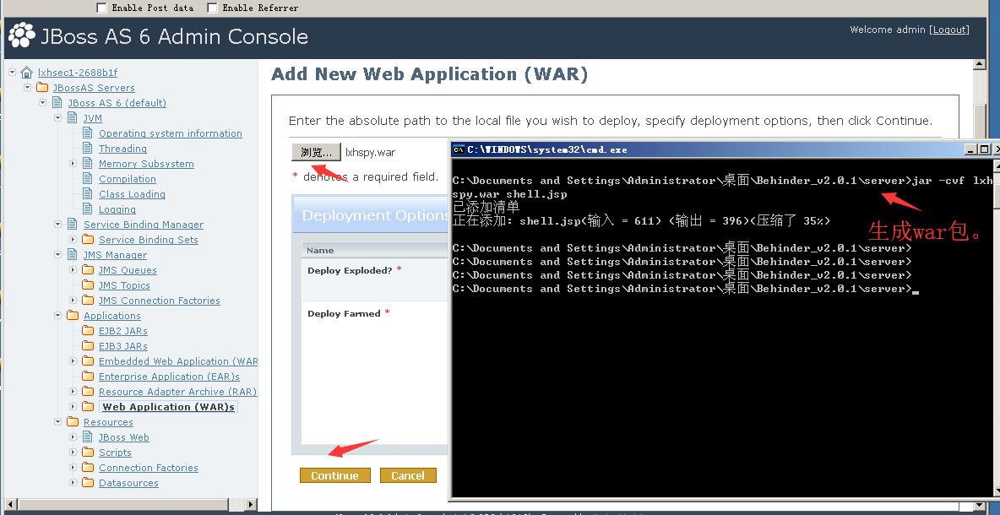
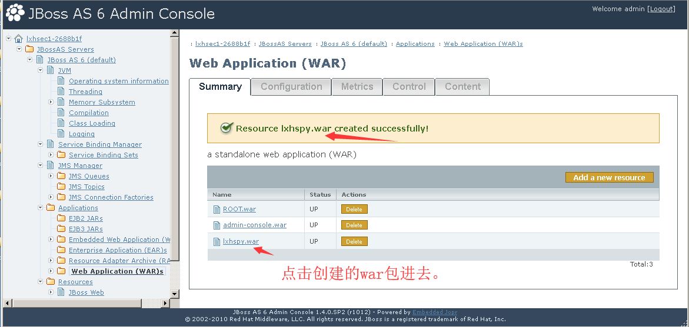
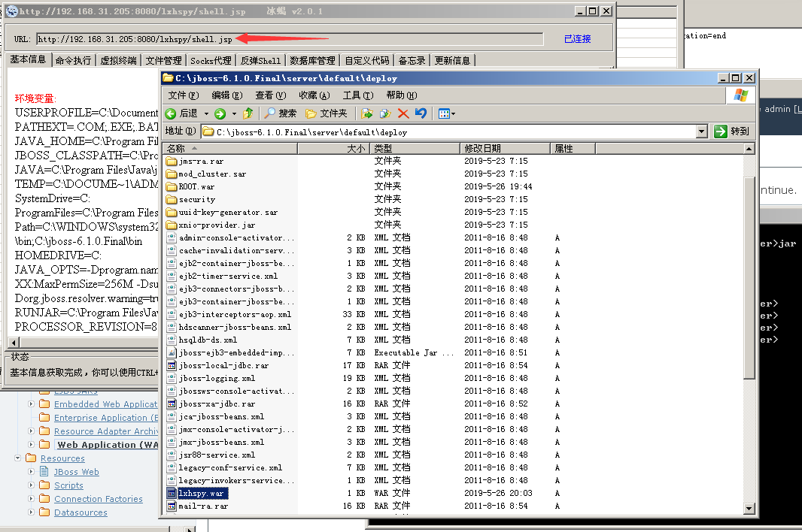
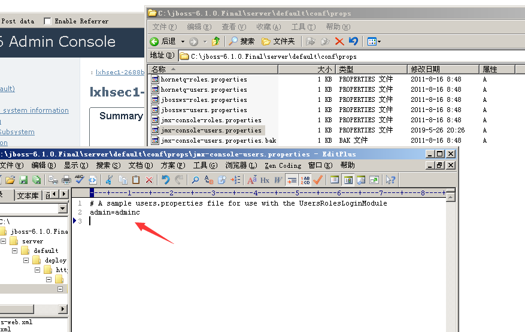

## Administration Console 弱口令 
Administration Console管理页面存在弱口令，`admin:admin`，登陆后台上传war包。

1. 点击Web Application (WAR)s

2. Add a new resource，上传war包

3. 点击创建的war包进入下一层，若状态为stop，点击Start按钮（默认都是start状态，不需要点击Start按钮）

4. 访问。
http://xx.xx.xx.xx/[warname]/shellname.jsp

### 修复建议
1. 修改密码
`C:\jboss-6.1.0.Final\server\default\conf\props\jmx-console-users.properties`

2. 或删除Administration Console页面。
JBoss版本>=6.0，admin-console页面路径为： `C:\jboss-6.1.0.Final\common\deploy\admin-console.war`
6.0之前的版本，路径为`C:\jboss-4.2.3\server\default\deploy\management\console-mgr.sar\web-console.war`
