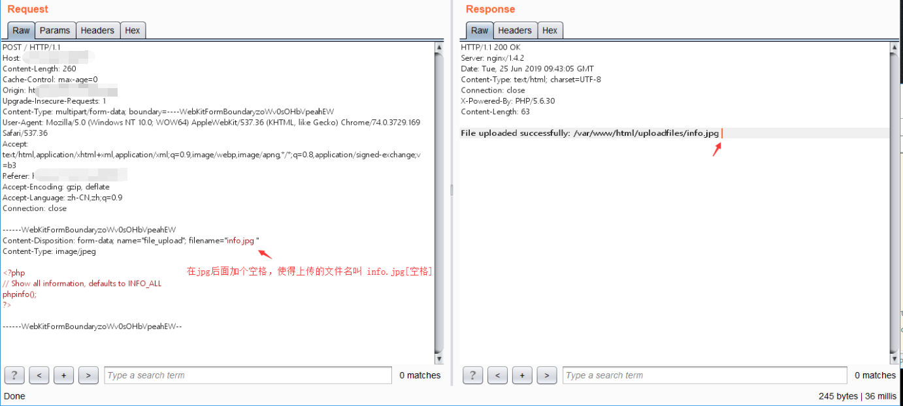
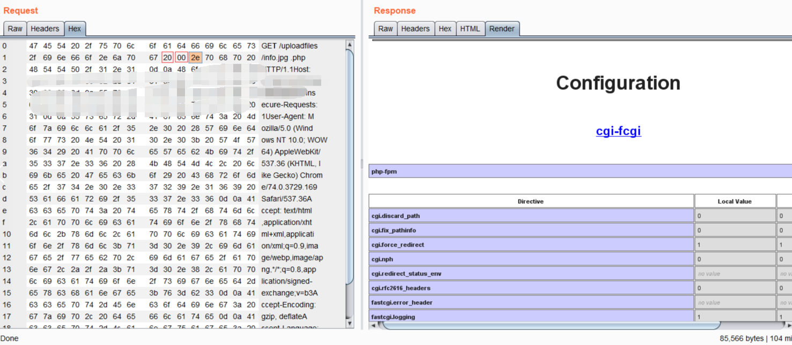

## Nginx 文件名逻辑漏洞（CVE-2013-4547）

影响版本：Nginx 0.8.41 ~ 1.4.3 / 1.5.0 ~ 1.5.7

在Windows弄了个环境，后来发现要文件名的后面存在空格，而Windows是不允许存在此类文件的，因此这里复现，使用[Vulhub](https://github.com/vulhub/vulhub/blob/master/nginx/CVE-2013-4547/README.md)的docker进行复现。

访问`http://your-ip:8080/` 上传文件

访问`http://your-ip:8080/uploadfiles/info.jpg`, 并抓包，修改为`info.jpg...php`, 在Hex选修卡中将jpg后面的两个点`2e`改成`20`,`00`
点击Go,如下。

Note:该漏洞不受`cgi.fix_pathinfo`影响，当其为0时，依旧解析，在Windows上有所限制。

### 修复建议
1. 设置security.limit_extensions = .php
2. 或升级Nginx