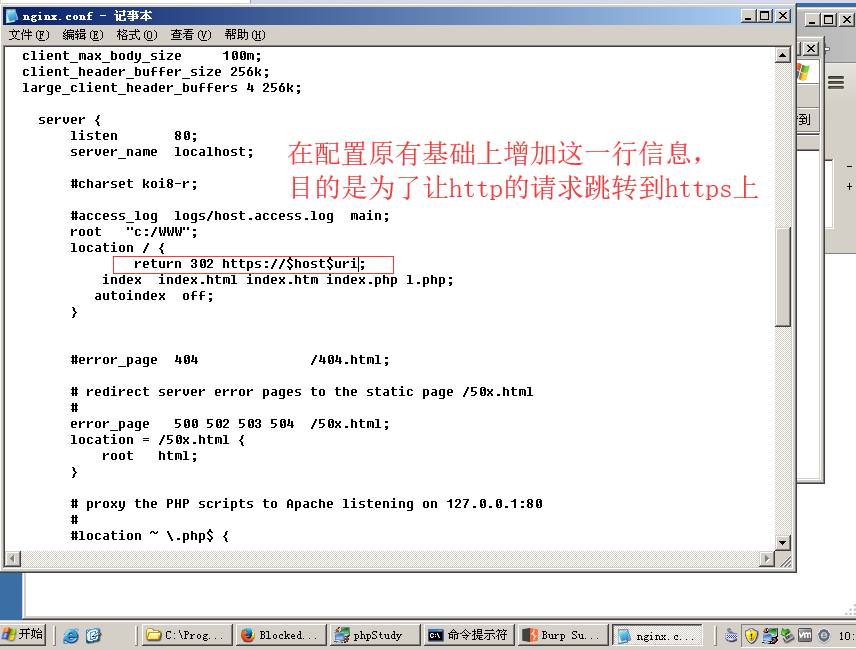
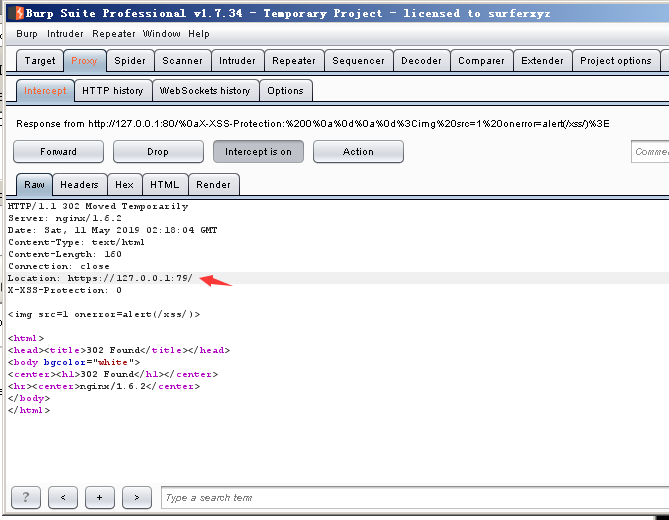
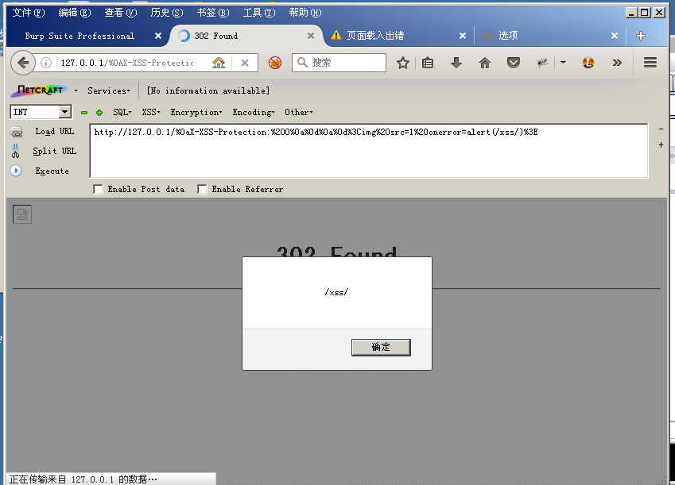
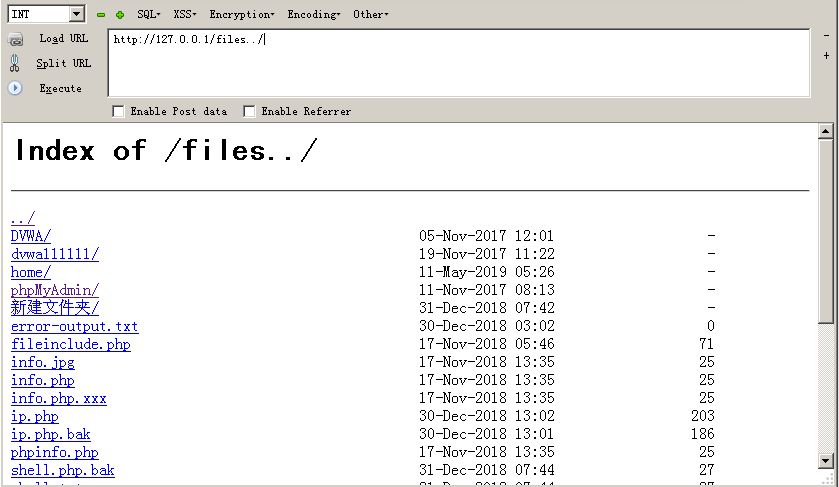
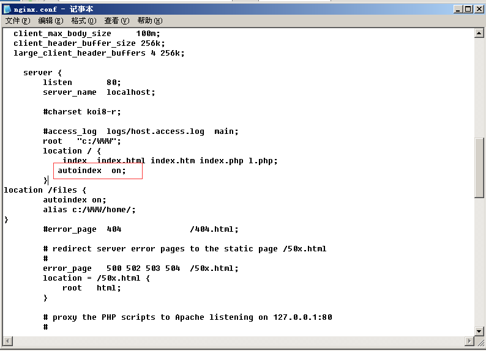
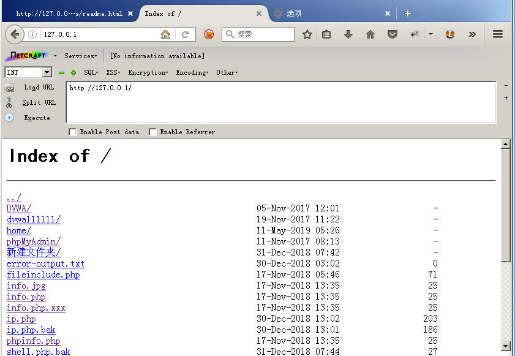
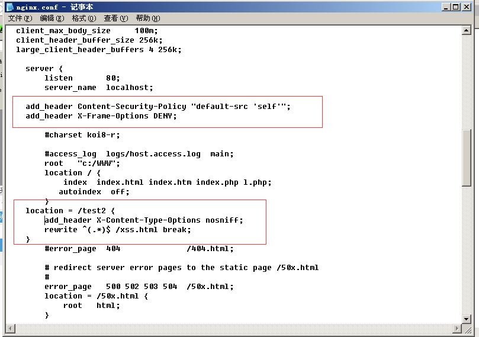
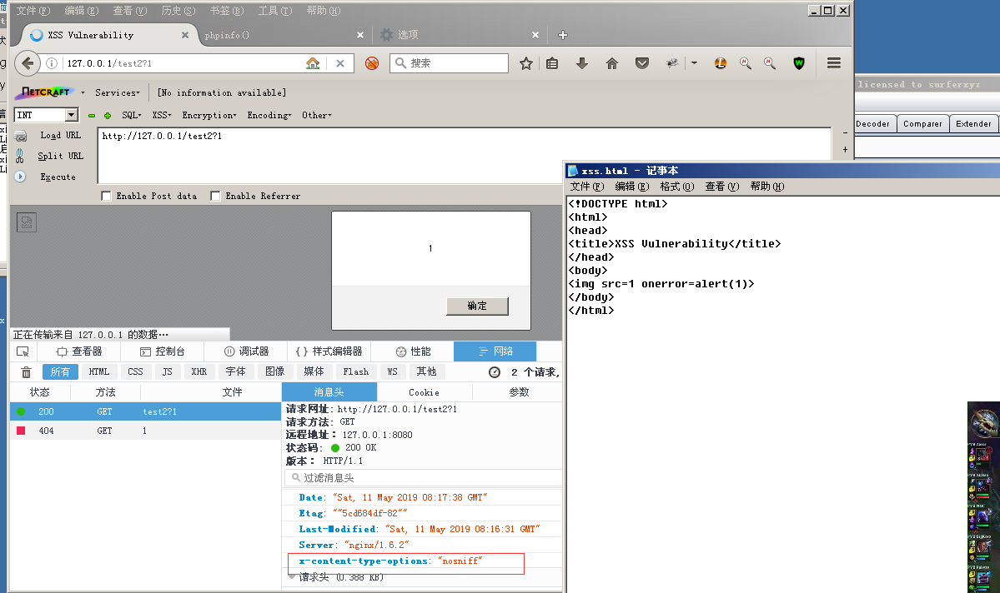

## Nginx 配置错误导致的安全问题

### CRLF注入

查看Nginx文档，可以发现有三个表示uri的变量：
1.$uri
2.$document_uri
3.$request_uri

1和2表示的是解码以后的请求路径，不带参数；3表示的是完整的URI（没有解码）

Nginx会将1，2进行解码，导致传入%0a%0d即可引入换行符，造成CRLF注入漏洞。

错误配置:


访问：
`http://127.0.0.1/%0aX-XSS-Protection:%200%0a%0d%0a%0d%3Cimg%20src=1%20onerror=alert(/xss/)%3E`
将返回包的Location端口设置为小于80，使得浏览器不进行跳转，执行XSS。

结果：



#### 修复建议

```
location / {
    return 302 https://$host$request_uri;
}
```

### 目录穿越

Nginx在配置别名（Alias）的时候，如果忘记加/，将造成一个目录穿越漏洞。

错误的配置文件示例（原本的目的是为了让用户访问到C:/WWW/home/目录下的文件）：
```
location /files {
	autoindex on;
	alias c:/WWW/home/;
}
```

结果：


#### 修复建议
只需要保证location和alias的值都有后缀/或都没有/这个后缀。

### 目录遍历

当Nginx配置文件中，autoindex 的值为on时，将造成一个目录遍历漏洞。



结果:



#### 修复建议
将autoindex 的值为置为off。

### add_header被覆盖

Nginx的配置文件分为Server、Location等一些配置块，并且存在包含关系，子块会继承父块的一些选项，比如add_header。

如下配置中，整站（父块中）添加了CSP头：



正常情况下访问:


当访问 /test2时，XSS被触发。因/test2的location中添加了X-Content-Type-Options头，导致父块中的add_header全部失效。


