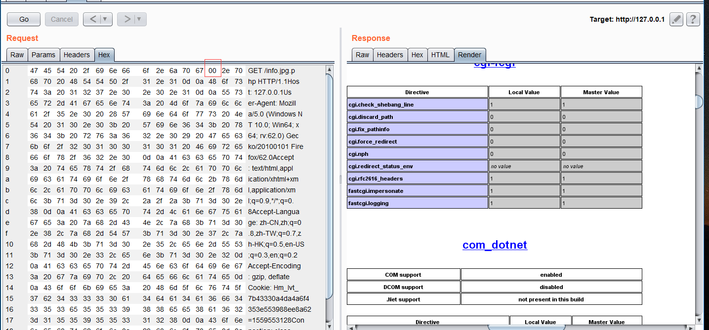

## Nginx 空字节任意代码执行漏洞

影响版本：Nginx `0.5*`, `0.6*`,`0.7 <= 0.7.65`,`0.8 <= 0.8.37`

这里提供个打包好的[Windows环境](./env) Nginx 0.7.65+php 5.3.2

解压后，在Nginx目录下执行startup.bat

然后在`nginx-0.7.65/html/`目录下创建info.jpg,内容为`<?php phpinfo();?>`,

访问`info.jpg`，并抓包，修改为`info.jpg..php`，在Hex选修卡中将jpg后面的`.`，更改为`00`.

Note:该漏洞不受`cgi.fix_pathinfo`影响，当其为0时，依旧解析。

### 修复建议
升级Nginx版本