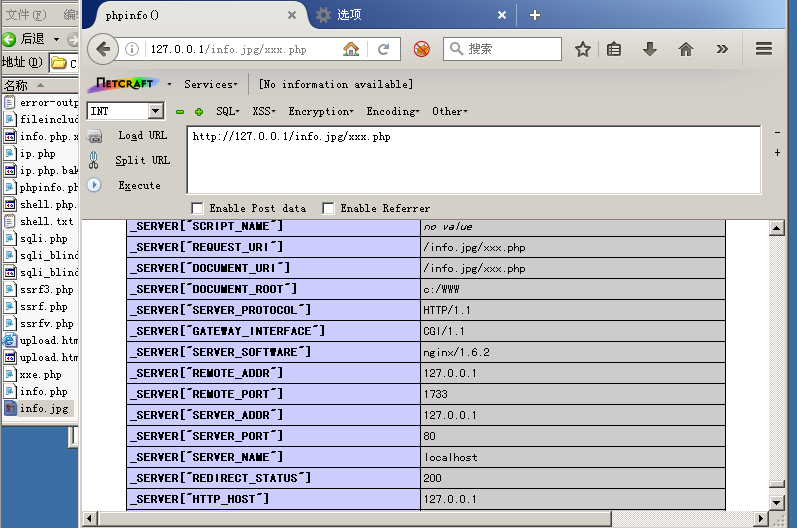
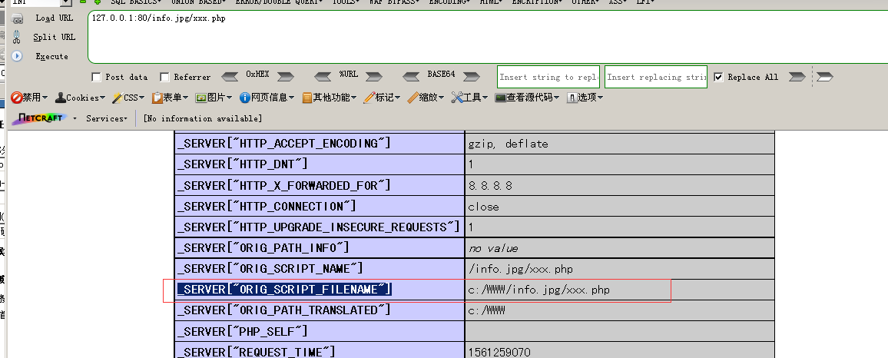
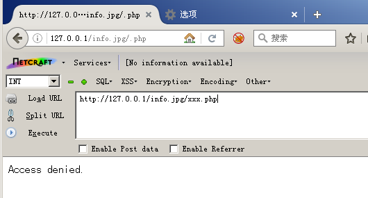

## Nginx配置文件错误导致的解析漏洞

对于任意文件名，在后面添加/xxx.php（xxx为任意字符）后,即可将文件作为php解析。
例：info.jpg后面加上/xxx.php，会将info.jpg 以php解析。

这里使用phpstudy2014 ，Nginx + PHP5.3n进行复现(以下复现若无特别说明均采用此环境)
结果：



该漏洞是Nginx配置所导致，与Nginx版本无关，下面是常见的漏洞配置。
```
server {
    location ~ \.php$ {
        root           /work/www/test;
        fastcgi_index  index.php;
        fastcgi_param  SCRIPT_FILENAME    
	$document_root$fastcgi_script_name;
        include        fastcgi_params;
        fastcgi_pass   unix:/tmp/php-fpm.sock;
    }
}
```

当攻击者访问/info.jpg/xxx.php时， Nginx将查看URL，看到它以.php结尾，并将路径传递给PHP fastcgi处理程序。
Nginx传给php的路径为`c:/WWW/info.jpg/xxx.php`,
在phpinfo中可以查看`_SERVER["ORIG_SCRIPT_FILENAME"]`得到。

PHP根据URL映射，在服务器上寻找xxx.php文件，但是xxx.php不存在，又由于cgi.fix_pathinfo默认是开启的，因此PHP 会继续检查路径中存在的文件，并将多余的部分当作 PATH_INFO。接着PHP在文件系统中找到.jpg文件，而后以PHP的形式执行.jpg的内容，并将/xxx.php存储在 PATH_INFO 后丢弃，因此我们在phpinfo中的`$_SERVER['PATH_INFO']`看的到值为空。

Note:**php的一个选项：cgi.fix_pathinfo，该选项默认开启，值为1，用于修理路径，**
例如：当php遇到文件路径"/info.jpg/xxx.php/lxh.sec"时，若"/info.jpg/xxx.php/lxh.sec"不存在，则会去掉最后的"/lxh.sec"，然后判断"/info.jpg/xxx.php"是否存在, 若存在则将/info.jpg/xxx.php当作文件/info.jpg/xxx.php/lxh.sec，若/info.jpg/xxx.php仍不存在，则继续去掉xxx.php,依此类推。

### 修复建议
1.配置cgi.fix_pathinfo(php.ini中)为0并重启php-cgi程序


结果：


2.或如果需要使用到cgi.fix_pathinfo这个特性（例如：Wordpress），那么可以禁止上传目录的执行脚本权限。
或将上传存储的内容与网站分离，即站库分离。

3.或高版本PHP提供了security.limit_extensions这个配置参数，设置`security.limit_extensions = .php`