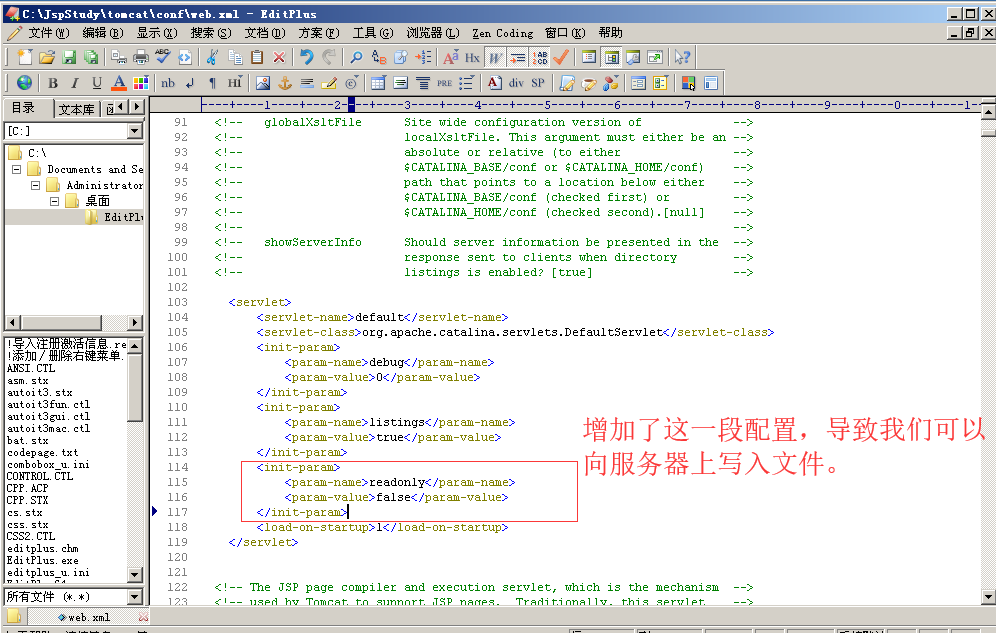
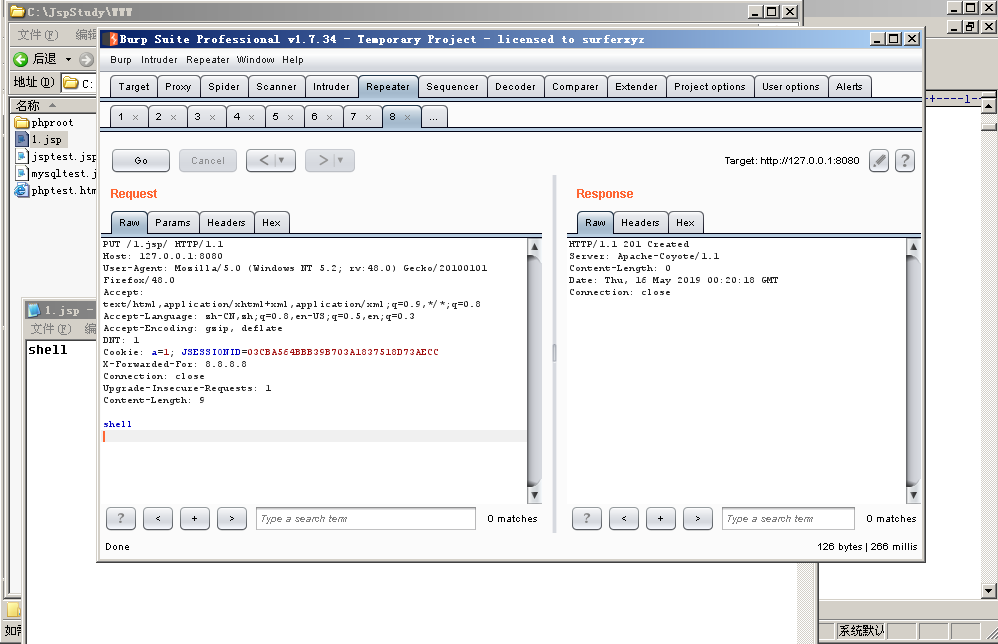
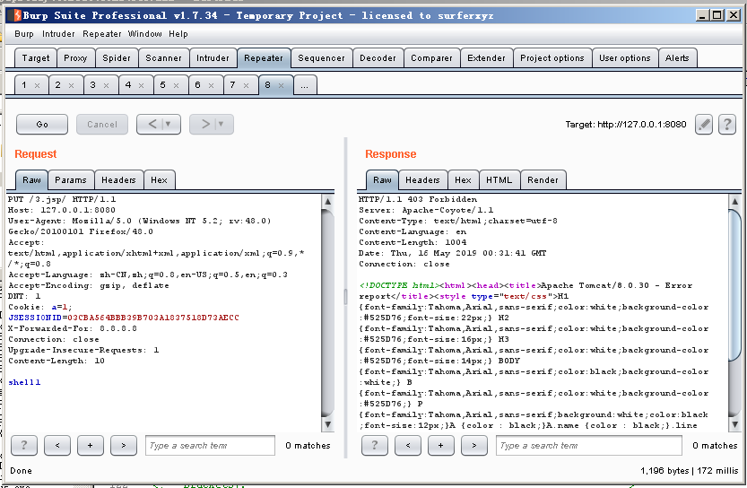

## Tomcat 任意文件写入（CVE-2017-12615）

环境：Tomcat/8.0.30

漏洞本质是Tomcat配置文件/conf/web.xml 配置了可写（readonly=false），导致我们可以往服务器写文件：

增加完配置之后，记得重启Tomcat，效果如下:

当readonly=true时，效果如下。

### 修复建议
将readonly=true，默认为true。