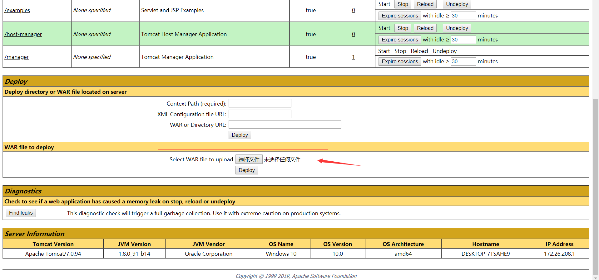
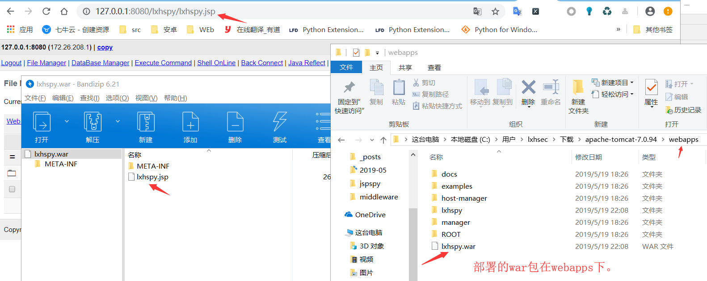
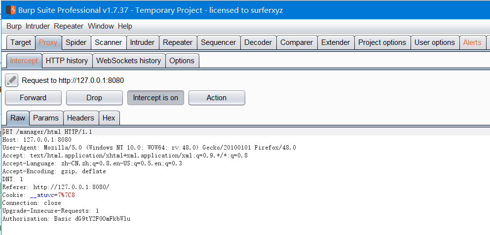
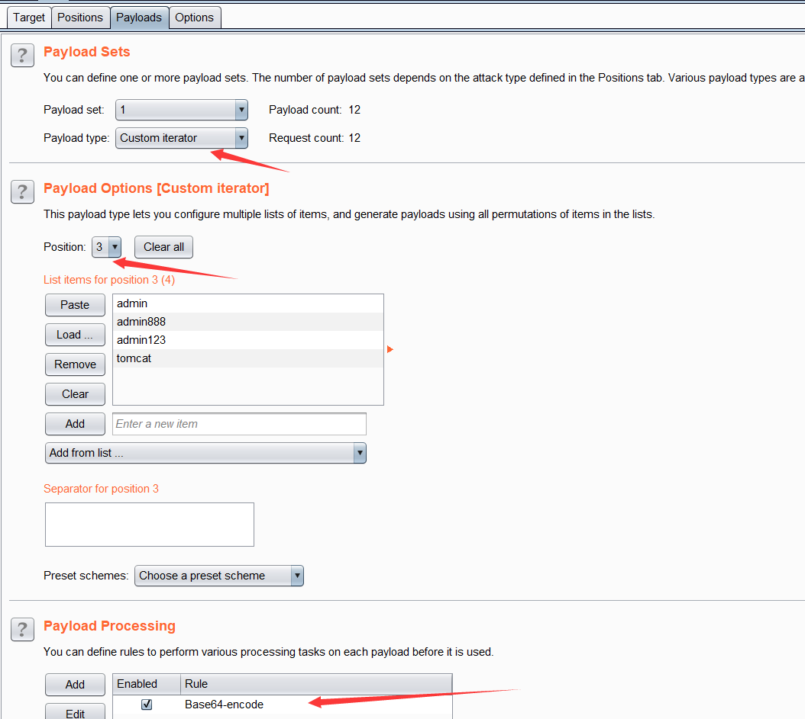
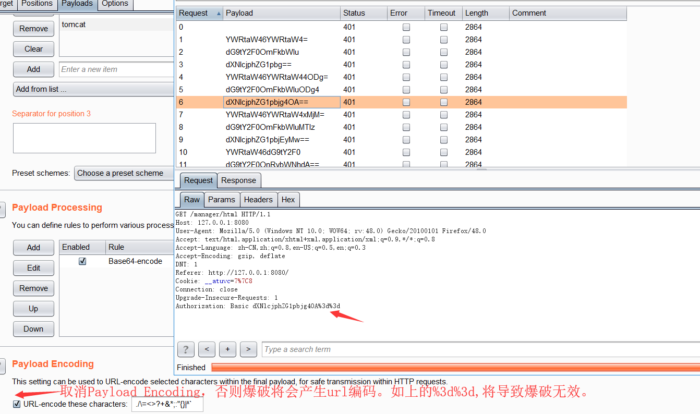
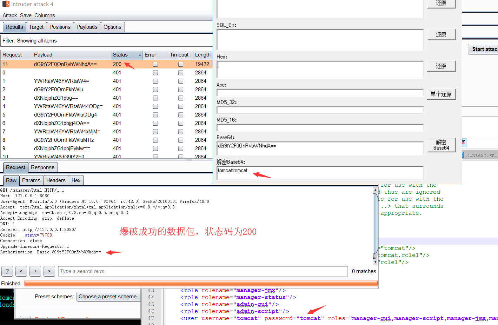

## Tomcat + 弱口令 && 后台getshell漏洞

环境：Apache Tomcat/7.0.94

在conf/tomcat-users.xml文件中配置用户的权限：

```
<tomcat-users>
    <role rolename="manager-gui"/>
    <role rolename="manager-script"/>
    <role rolename="manager-jmx"/>
    <role rolename="manager-status"/>
    <role rolename="admin-gui"/>
    <role rolename="admin-script"/>
    <user username="tomcat" password="tomcat" roles="manager-gui,manager-script,manager-jmx,manager-status,admin-gui,admin-script" />
</tomcat-users>
```

正常安装的情况下，tomcat7.0.94中默认没有任何用户，且manager页面只允许本地IP访问。只有管理员手工修改了这些属性的情况下，才可以进行攻击。

访问 http://127.0.0.1:8080/manager/html ,输入弱密码tomcat:tomcat，登陆后台。


生成war包：
jar -cvf lxhspy.war lxhspy.jsp

部署后，访问 http://127.0.0.1:8080/war包名/包名内文件名, 如下。


### 修复建议
1. 若无必要，取消manager/html功能。
2. 若要使用，manager页面应只允许本地IP访问


## Tomcat manager App 暴力破解

环境：Apache Tomcat/7.0.94

访问：http://127.0.0.1:8080/manager/html, 输入密码，抓包，如下。



刚才输入的账号密码在HTTP字段中的Authorization中，规则为Base64Encode(user:passwd)
Authorization: Basic dG9tY2F0OmFkbWlu
解码之后如下：


将数据包发送到intruder模块，并标记dG9tY2F0OmFkbWlu。

Payload type选择 Custom iterator，设置三个position，1为用户字典，2为`:`，3为密码字典，并增加Payload Processing 为Base64-encode如下：


最后取消Palyload Encoding编码。


结果：


### 修复建议
1. 若无必要，取消manager/html功能。
2. 若要使用，manager页面应只允许本地IP访问