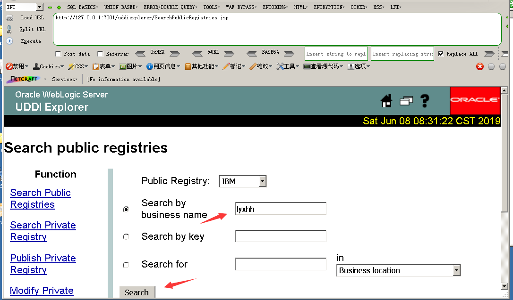
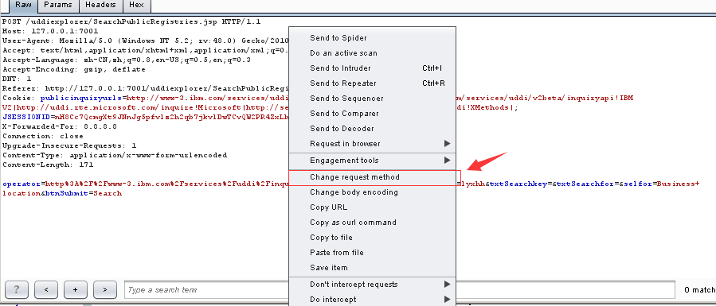
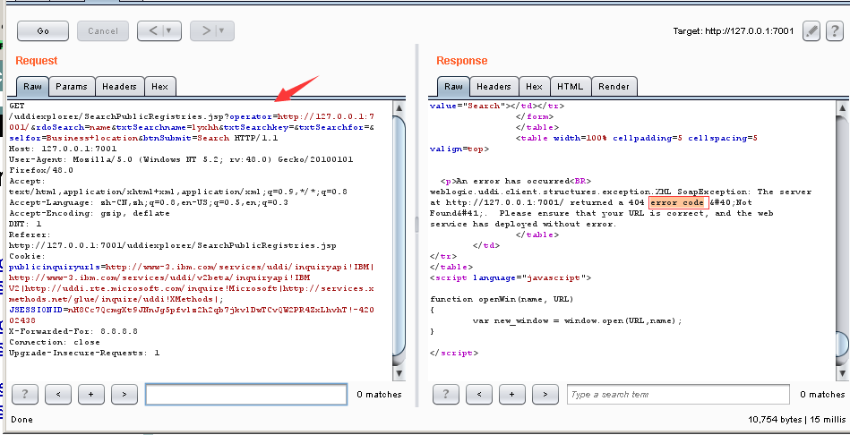
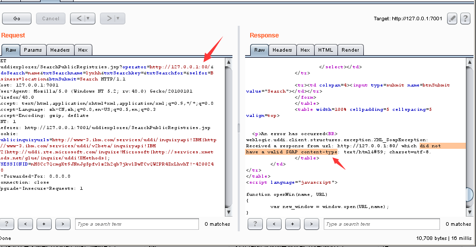
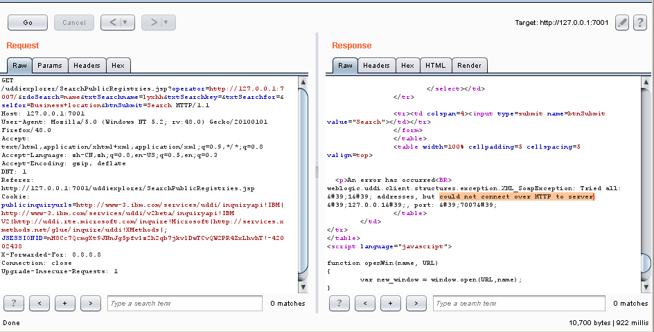
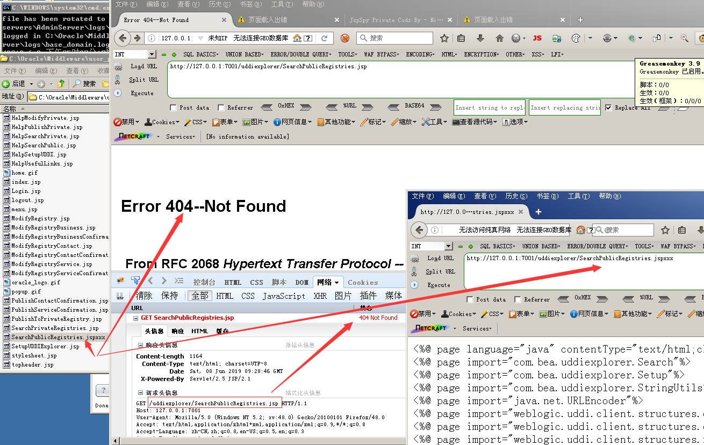

## Weblogic SSRF漏洞 （CVE-2014-4210）

影响版本：10.0.2.0, 10.3.6.0

访问 /uddiexplorer/SearchPublicRegistries.jsp，若能正常访问，则可能存在此漏洞，填写任意信息，如下

点击Search，并抓包，抓包之后在Burp中右键，选择Change request method, 将POST请求改变成GET。

参数operator为SSRF的可控参数，将其更改为开放的端口，如`http://127.0.0.1:7001/`，将返回error code

若开放端口为HTTP协议，则会返回did not have a valid SOAP content-type。

访问不存在的端口，将返回`could not connect over HTTP to server`

通过 返回数据包 中的错误信息，即可探测内网状态。

### 修复建议
删除SearchPublicRegistries.jsp文件或修改SearchPublicRegistries.jsp文件后缀为不解析后缀，如SearchPublicRegistries.jspxxx，后重启Weblogic，再次访问，如下：

SearchPublicRegistries.jsp路径为：
`C:\Oracle\Middleware\user_projects\domains\base_domain\servers\AdminServer\tmp\_WL_internal\uddiexplorer\5f6ebw\war`
