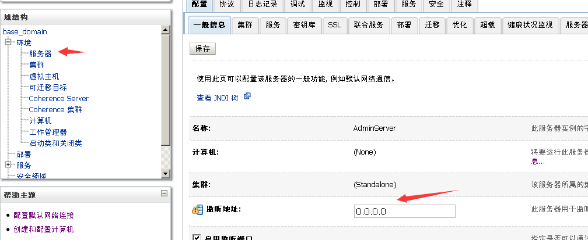

# WebLogic

WebLogic是美国Oracle公司出品的一个applicationserver，确切的说是一个基于JAVAEE架构的中间件，WebLogic是用于开发、集成、部署和管理大型分布式Web应用、网络应用和数据库应用的Java应用服务器。将Java的动态功能和Java Enterprise标准的安全性引入大型网络应用的开发、集成、部署和管理之中。

默认端口:7001

测试环境版本：10.3.6
下载地址：https://download.oracle.com/otn/nt/middleware/11g/wls/1036/wls1036_win32.exe?AuthParam=1559386164_88cf328d83f60337f08c2c94ee292954

下载完成后双击运行，一直点下一步就ok了。

安装完成之后，在`C:\Oracle\Middleware\user_projects\domains\base_domain`这个目录双击`startWebLogic.cmd`启动Weblogic服务。

浏览器访问：http://127.0.0.1:7001/, 界面上出现Error 404--Not Found，即启动成功。

设置外网访问，在 域结构 -> 环境 -> 服务器
右边选择相应的Server（管理服务器），打开进行编辑，在监听地址:中填入0.0.0.0，保存后，重启Weblogic服务器即可。

以下复现若无特别说明均采用Weblogic 10.3.6