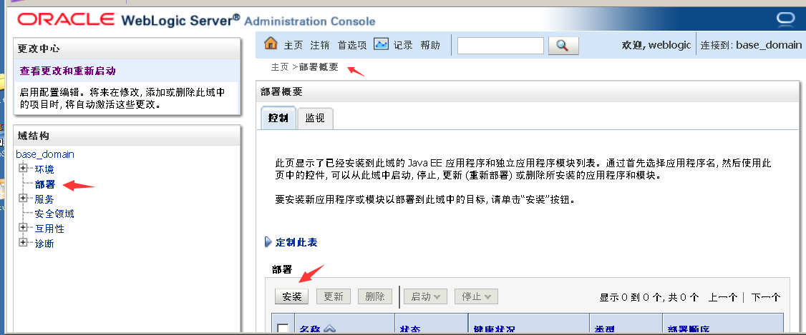
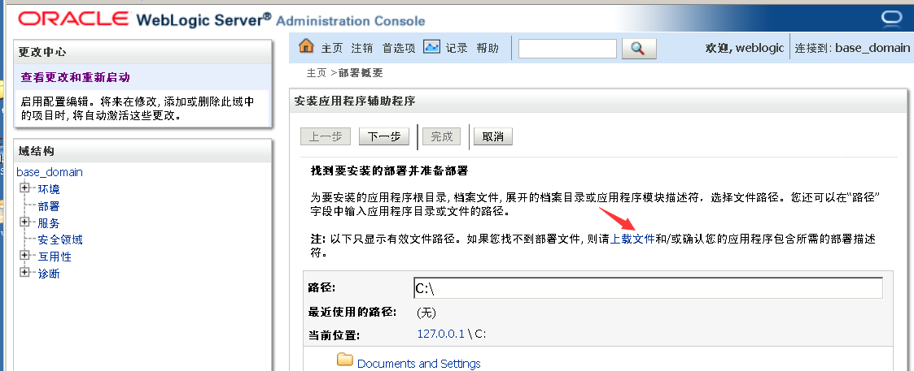
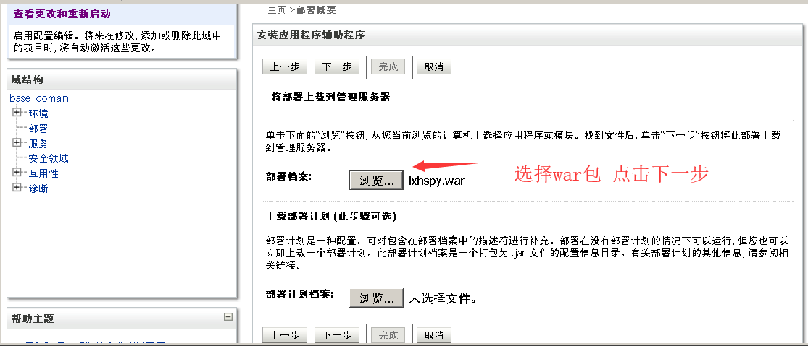
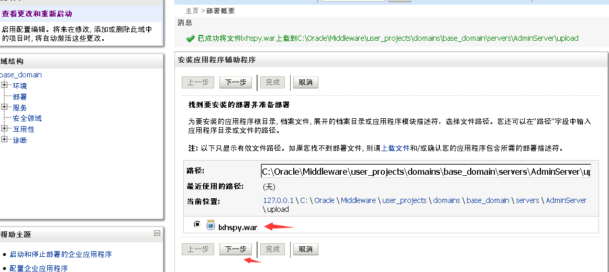
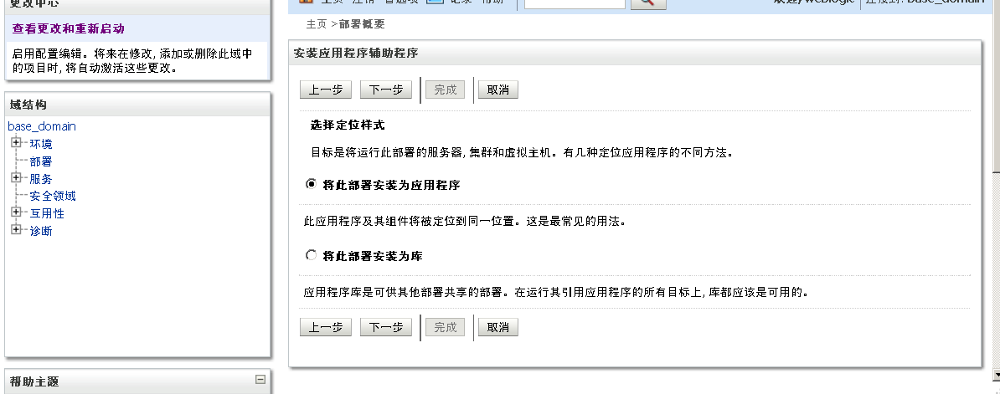
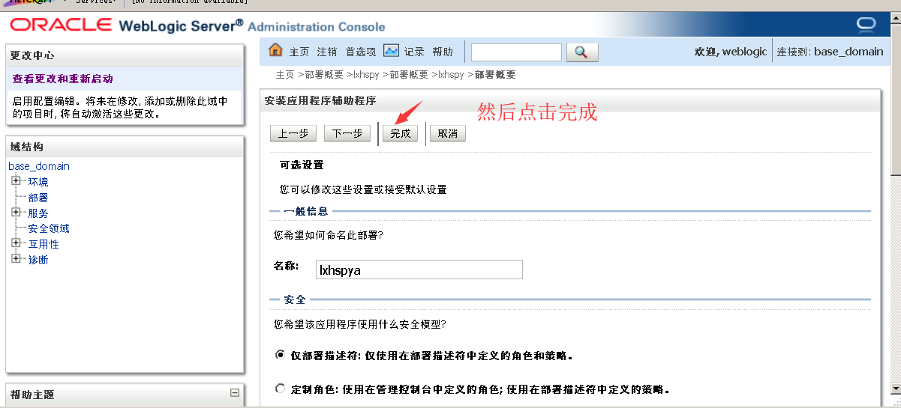
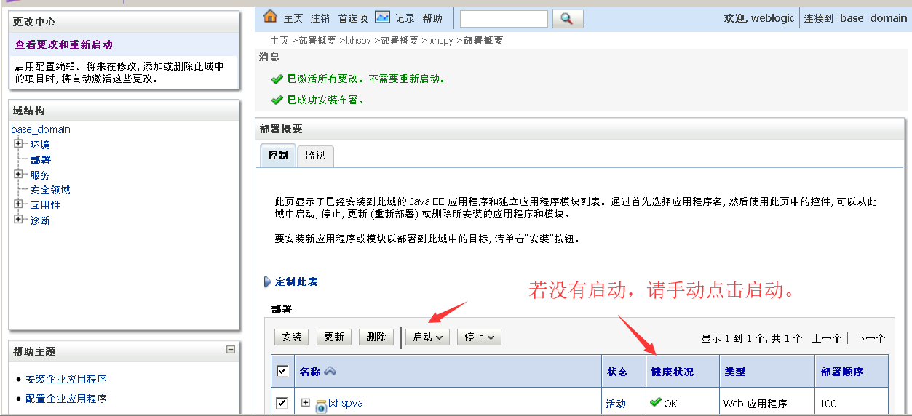
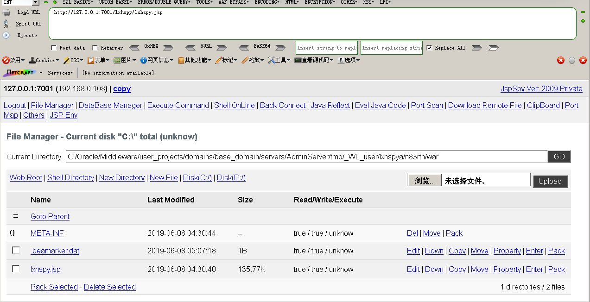

## Weblogic 弱口令 && 后台getshell

弱口令参考：https://cirt.net/passwords?criteria=WebLogic

访问`http://127.0.0.1:7001/console` 
自动重定向到`http://127.0.0.1:7001/console/login/LoginForm.jsp`，使用弱口令登陆后台。

点击部署，进一步点击右边的安装。

点击上载文件，

选择war包，点击下一步

上传完成以后选中你上传的文件,点击下一步

选中作为应用程序安装，点击下一步

然后直接点击完成即可

选用我们安装的应用，点击启动即可。

访问：`http://ip:port/[war包名]/[包名内文件名]`

### 修复建议
避免后台弱口令。