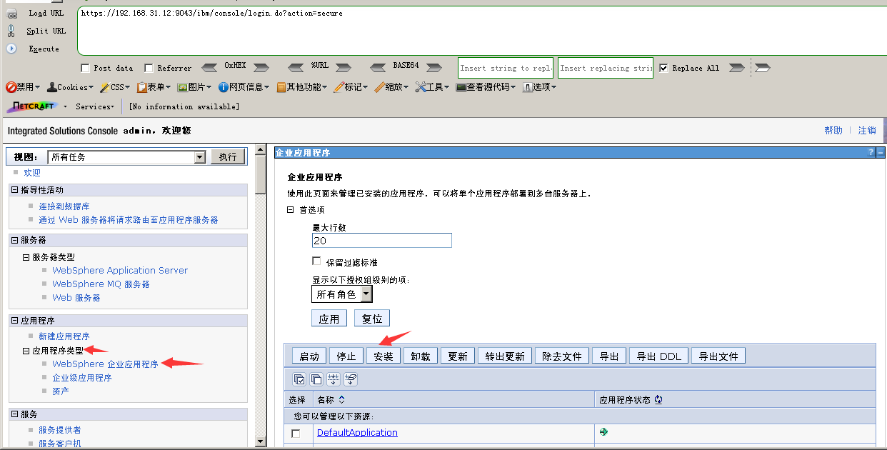
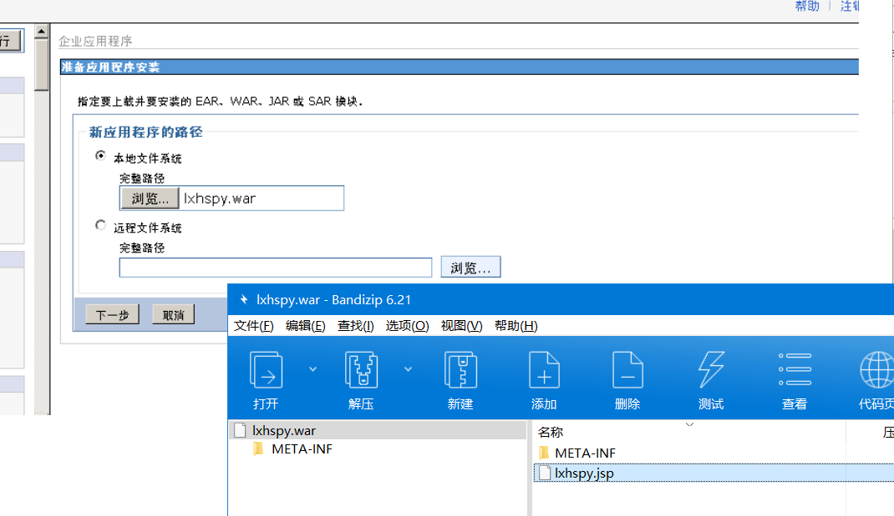
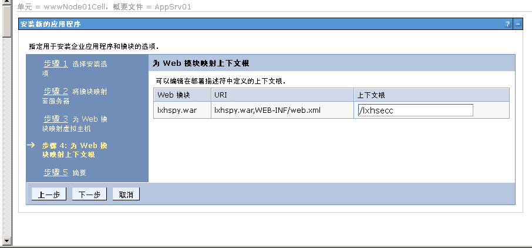
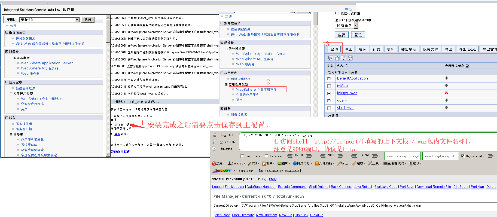

## 弱口令 && 后台Getshell
1. 在6.x至7.0版本，后台登陆只需要输入 admin作为用户标识，无需密码，即可登陆后台。
2. websphere/ websphere
3. system/ manager

1.点击WebSphere 企业应用程序，点击安装。

2.上传war包，点击下一步。

3.一直点击下一步，直到下图，填写上下文根，关系到你访问的URL，接着一直点下一步直到安装完成。

4.安装完成之后，点击保存主配置，然后回到WebSphere 企业应用程序，选中war包启动，访问shell。

### 修复建议
设置密码。